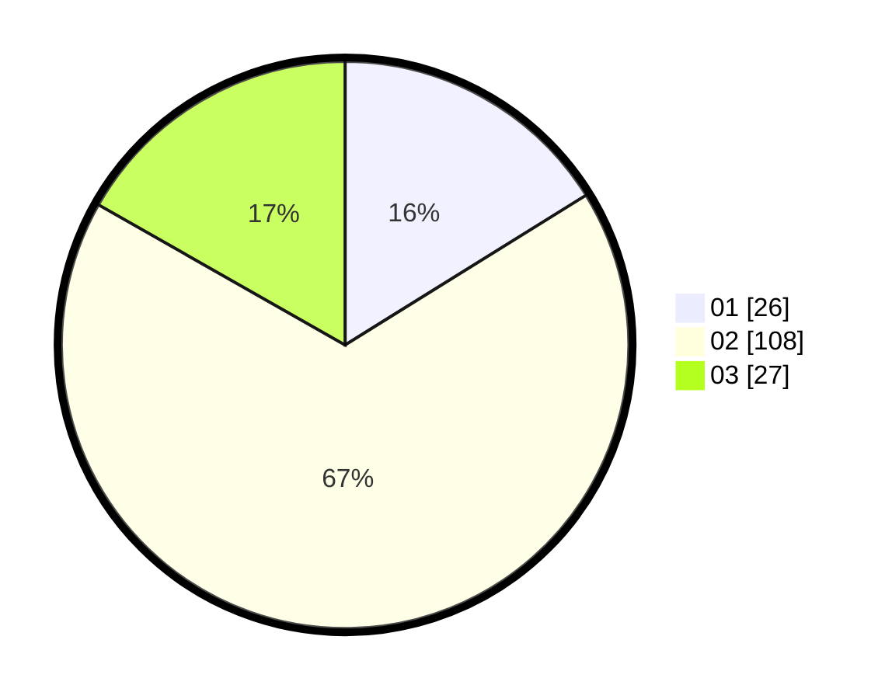

# Hasil

Hasil perolehan suara paslon dapat dilihat pada file paslon-01.txt, paslon-02.txt, dan paslon-03.txt.

Jika tidak ada, artinya data tersebut belum ada pada SIREKAP.

## Perolehan Suara

 * Paslon 01: **26**.
 * Paslon 02: **108**.
 * Paslon 03: **27**.

## Foto C Plano

https://sirekap-obj-formc.kpu.go.id/1279/pemilu/ppwp/31/71/08/10/04/3171081004006-20240216-150541--ba30f399-acd6-47dd-9170-2047719cca7c.jpg

https://sirekap-obj-formc.kpu.go.id/1279/pemilu/ppwp/31/71/08/10/04/3171081004006-20240216-150543--879ad80c-9b53-4764-ba96-3f57b77ed632.jpg

https://sirekap-obj-formc.kpu.go.id/1279/pemilu/ppwp/31/71/08/10/04/3171081004006-20240216-150542--ba5df42f-9567-424d-b063-3ee1534a1c92.jpg

## DATA PEMILIH TETAP

Jumlah pemilih dalam DPT: **233**.
 * L: **113**.
 * P: **120**.

## DATA PENGGUNA HAK PILIH

Jumlah pengguna hak pilih dalam DPT: **164**.
 * L: **75**.
 * P: **89**.

Jumlah pengguna hak pilih dalam DPTb: **0**.
 * L: **0**.
 * P: **0**.

Jumlah pengguna hak pilih dalam DPK: **0**.
 * L: **0**.
 * P: **0**.

Jumlah pengguna hak pilih: **164**.
 * L: **75**.
 * P: **89**.

## JUMLAH SUARA SAH DAN TIDAK SAH

JUMLAH SELURUH SUARA SAH: **161**.

JUMLAH SUARA TIDAK SAH: **3**.

JUMLAH SELURUH SUARA SAH DAN SUARA TIDAK SAH: **164**.
