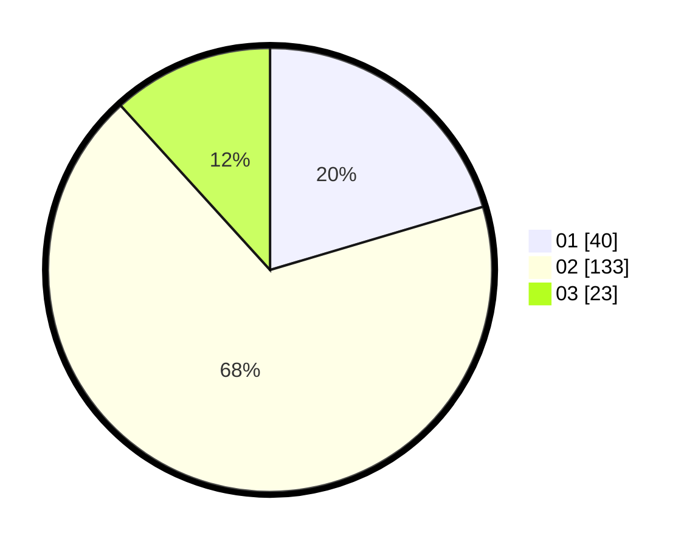

# Hasil

Hasil perolehan suara paslon dapat dilihat pada file paslon-01.txt, paslon-02.txt, dan paslon-03.txt.

Jika tidak ada, artinya data tersebut belum ada pada SIREKAP.

## Perolehan Suara

 * Paslon 01: **40**.
 * Paslon 02: **133**.
 * Paslon 03: **23**.

## Foto C Plano

https://sirekap-obj-formc.kpu.go.id/3761/pemilu/ppwp/31/71/08/10/04/3171081004009-20240216-132505--6e8643bf-01c4-49b0-b72a-1371cd994212.jpg

https://sirekap-obj-formc.kpu.go.id/3761/pemilu/ppwp/31/71/08/10/04/3171081004009-20240216-132506--b047f14b-4908-4c2d-94db-fdb6b8ab68ea.jpg

https://sirekap-obj-formc.kpu.go.id/3761/pemilu/ppwp/31/71/08/10/04/3171081004009-20240216-132505--7d17f32e-c44f-459a-abfd-7f26ee0b4870.jpg

## DATA PEMILIH TETAP

Jumlah pemilih dalam DPT: **251**.
 * L: **134**.
 * P: **117**.

## DATA PENGGUNA HAK PILIH

Jumlah pengguna hak pilih dalam DPT: **198**.
 * L: **100**.
 * P: **98**.

Jumlah pengguna hak pilih dalam DPTb: **2**.
 * L: **1**.
 * P: **1**.

Jumlah pengguna hak pilih dalam DPK: **2**.
 * L: **1**.
 * P: **1**.

Jumlah pengguna hak pilih: **202**.
 * L: **102**.
 * P: **100**.

## JUMLAH SUARA SAH DAN TIDAK SAH

JUMLAH SELURUH SUARA SAH: **196**.

JUMLAH SUARA TIDAK SAH: **6**.

JUMLAH SELURUH SUARA SAH DAN SUARA TIDAK SAH: **202**.
