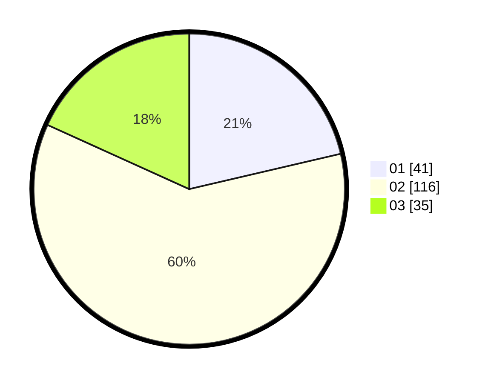

# Hasil

Hasil perolehan suara paslon dapat dilihat pada file paslon-01.txt, paslon-02.txt, dan paslon-03.txt.

Jika tidak ada, artinya data tersebut belum ada pada SIREKAP.

## Perolehan Suara

 * Paslon 01: **41**.
 * Paslon 02: **116**.
 * Paslon 03: **35**.

## Foto C Plano

https://sirekap-obj-formc.kpu.go.id/e2c4/pemilu/ppwp/31/71/08/10/04/3171081004010-20240216-183150--7d82daf6-7fa0-49f1-8a65-75217c2bc1c2.jpg

https://sirekap-obj-formc.kpu.go.id/e2c4/pemilu/ppwp/31/71/08/10/04/3171081004010-20240216-183152--4f1ce990-359b-4dd3-8db8-611c53955d27.jpg

https://sirekap-obj-formc.kpu.go.id/e2c4/pemilu/ppwp/31/71/08/10/04/3171081004010-20240216-183151--52fdd8ac-0c0d-470e-8c5f-2c9efe72feb7.jpg

## DATA PEMILIH TETAP

Jumlah pemilih dalam DPT: **250**.
 * L: **126**.
 * P: **124**.

## DATA PENGGUNA HAK PILIH

Jumlah pengguna hak pilih dalam DPT: **190**.
 * L: **102**.
 * P: **88**.

Jumlah pengguna hak pilih dalam DPTb: **1**.
 * L: **0**.
 * P: **1**.

Jumlah pengguna hak pilih dalam DPK: **4**.
 * L: **4**.
 * P: **0**.

Jumlah pengguna hak pilih: **195**.
 * L: **106**.
 * P: **89**.

## JUMLAH SUARA SAH DAN TIDAK SAH

JUMLAH SELURUH SUARA SAH: **192**.

JUMLAH SUARA TIDAK SAH: **3**.

JUMLAH SELURUH SUARA SAH DAN SUARA TIDAK SAH: **195**.
