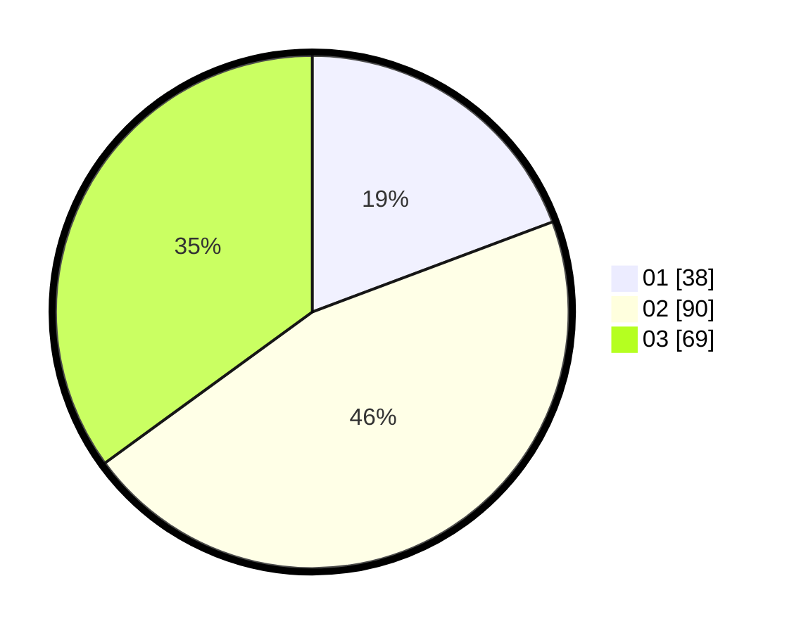

# Hasil

Hasil perolehan suara paslon dapat dilihat pada file paslon-01.txt, paslon-02.txt, dan paslon-03.txt.

Jika tidak ada, artinya data tersebut belum ada pada SIREKAP.

## Perolehan Suara

 * Paslon 01: **38**.
 * Paslon 02: **90**.
 * Paslon 03: **69**.

## Foto C Plano

https://sirekap-obj-formc.kpu.go.id/58a2/pemilu/ppwp/31/71/08/10/04/3171081004013-20240216-152338--f2cd8faf-b169-4b32-a804-c17ff209274b.jpg

https://sirekap-obj-formc.kpu.go.id/58a2/pemilu/ppwp/31/71/08/10/04/3171081004013-20240216-152340--285d338e-8322-4859-951c-db4aebb7535a.jpg

https://sirekap-obj-formc.kpu.go.id/58a2/pemilu/ppwp/31/71/08/10/04/3171081004013-20240216-152339--a6ad1d72-5b49-48d7-b832-bb53ae4e7e69.jpg

## DATA PEMILIH TETAP

Jumlah pemilih dalam DPT: **253**.
 * L: **125**.
 * P: **128**.

## DATA PENGGUNA HAK PILIH

Jumlah pengguna hak pilih dalam DPT: **190**.
 * L: **95**.
 * P: **95**.

Jumlah pengguna hak pilih dalam DPTb: **6**.
 * L: **2**.
 * P: **4**.

Jumlah pengguna hak pilih dalam DPK: **2**.
 * L: **1**.
 * P: **1**.

Jumlah pengguna hak pilih: **198**.
 * L: **98**.
 * P: **100**.

## JUMLAH SUARA SAH DAN TIDAK SAH

JUMLAH SELURUH SUARA SAH: **197**.

JUMLAH SUARA TIDAK SAH: **1**.

JUMLAH SELURUH SUARA SAH DAN SUARA TIDAK SAH: **198**.
