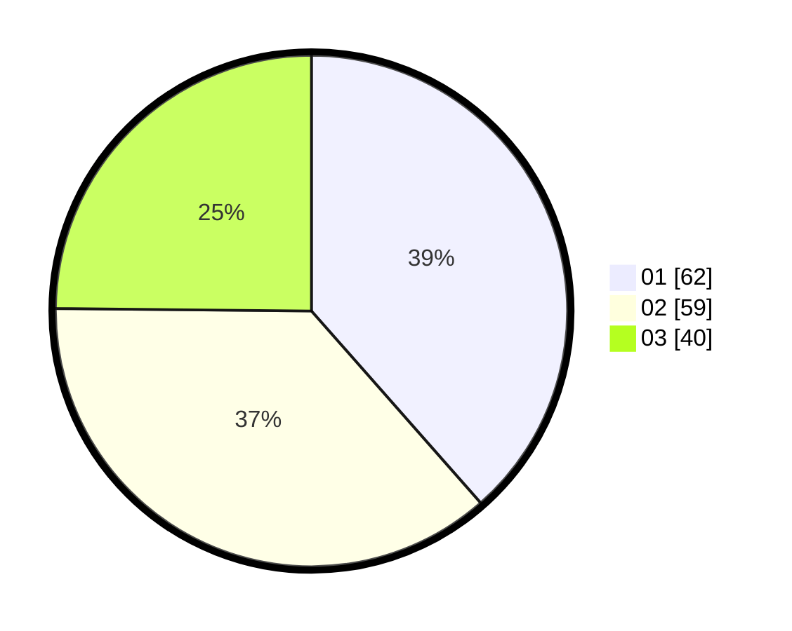

# Hasil

Hasil perolehan suara paslon dapat dilihat pada file paslon-01.txt, paslon-02.txt, dan paslon-03.txt.

Jika tidak ada, artinya data tersebut belum ada pada SIREKAP.

## Perolehan Suara

 * Paslon 01: **62**.
 * Paslon 02: **59**.
 * Paslon 03: **40**.

## Foto C Plano

https://sirekap-obj-formc.kpu.go.id/5b75/pemilu/ppwp/31/71/08/10/04/3171081004017-20240214-155840--749550bc-5a9d-4d99-bc00-3a2567a07a77.jpg

https://sirekap-obj-formc.kpu.go.id/5b75/pemilu/ppwp/31/71/08/10/04/3171081004017-20240216-175619--f17f9862-7834-4fd9-9b1c-fa89b7486ff5.jpg

https://sirekap-obj-formc.kpu.go.id/5b75/pemilu/ppwp/31/71/08/10/04/3171081004017-20240216-175618--d0e17423-b1eb-403e-a037-fb16b7116a80.jpg

## DATA PEMILIH TETAP

Jumlah pemilih dalam DPT: **235**.
 * L: **115**.
 * P: **120**.

## DATA PENGGUNA HAK PILIH

Jumlah pengguna hak pilih dalam DPT: **160**.
 * L: **76**.
 * P: **84**.

Jumlah pengguna hak pilih dalam DPTb: **0**.
 * L: **0**.
 * P: **0**.

Jumlah pengguna hak pilih dalam DPK: **2**.
 * L: **2**.
 * P: **0**.

Jumlah pengguna hak pilih: **162**.
 * L: **78**.
 * P: **84**.

## JUMLAH SUARA SAH DAN TIDAK SAH

JUMLAH SELURUH SUARA SAH: **161**.

JUMLAH SUARA TIDAK SAH: **1**.

JUMLAH SELURUH SUARA SAH DAN SUARA TIDAK SAH: **162**.
