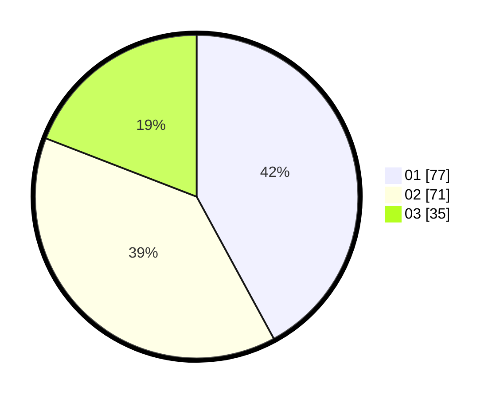

# Hasil

Hasil perolehan suara paslon dapat dilihat pada file paslon-01.txt, paslon-02.txt, dan paslon-03.txt.

Jika tidak ada, artinya data tersebut belum ada pada SIREKAP.

## Perolehan Suara

 * Paslon 01: **77**.
 * Paslon 02: **71**.
 * Paslon 03: **35**.

## Foto C Plano

https://sirekap-obj-formc.kpu.go.id/9b25/pemilu/ppwp/31/71/08/10/04/3171081004022-20240216-064538--725e5bd1-77f3-48ee-bd2e-2a3446af59f3.jpg

https://sirekap-obj-formc.kpu.go.id/9b25/pemilu/ppwp/31/71/08/10/04/3171081004022-20240216-064552--5aabbdac-babb-4410-8bfd-807dae7d194e.jpg

https://sirekap-obj-formc.kpu.go.id/9b25/pemilu/ppwp/31/71/08/10/04/3171081004022-20240216-064548--3acc9459-e023-4f91-8d42-25b216339c67.jpg

## DATA PEMILIH TETAP

Jumlah pemilih dalam DPT: **256**.
 * L: **125**.
 * P: **131**.

## DATA PENGGUNA HAK PILIH

Jumlah pengguna hak pilih dalam DPT: **183**.
 * L: **91**.
 * P: **92**.

Jumlah pengguna hak pilih dalam DPTb: **1**.
 * L: **1**.
 * P: **0**.

Jumlah pengguna hak pilih dalam DPK: **1**.
 * L: **1**.
 * P: **0**.

Jumlah pengguna hak pilih: **185**.
 * L: **93**.
 * P: **92**.

## JUMLAH SUARA SAH DAN TIDAK SAH

JUMLAH SELURUH SUARA SAH: **183**.

JUMLAH SUARA TIDAK SAH: **2**.

JUMLAH SELURUH SUARA SAH DAN SUARA TIDAK SAH: **185**.
