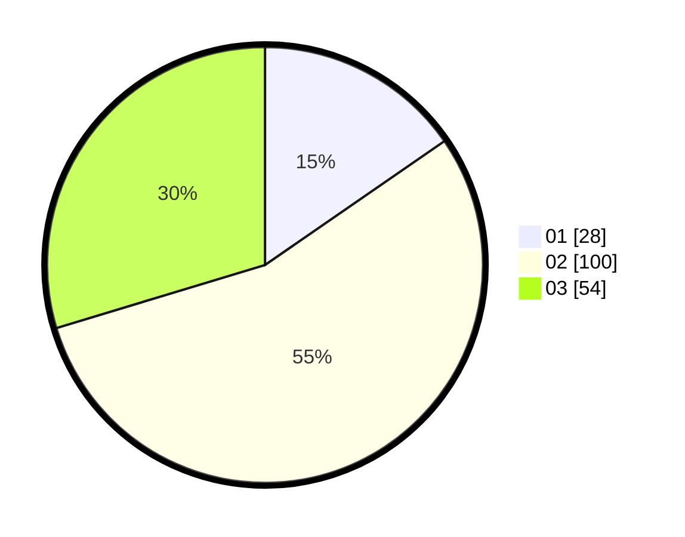

# Hasil

Hasil perolehan suara paslon dapat dilihat pada file paslon-01.txt, paslon-02.txt, dan paslon-03.txt.

Jika tidak ada, artinya data tersebut belum ada pada SIREKAP.

## Perolehan Suara

 * Paslon 01: **28**.
 * Paslon 02: **100**.
 * Paslon 03: **54**.

## Foto C Plano

https://sirekap-obj-formc.kpu.go.id/20c4/pemilu/ppwp/31/71/08/10/04/3171081004027-20240214-235537--eeb3c4f8-6e94-40df-a7dd-d77dcad7bf98.jpg

https://sirekap-obj-formc.kpu.go.id/20c4/pemilu/ppwp/31/71/08/10/04/3171081004027-20240214-235657--b067952a-8bc6-4842-b8f1-dbbf04681e64.jpg

https://sirekap-obj-formc.kpu.go.id/20c4/pemilu/ppwp/31/71/08/10/04/3171081004027-20240214-235646--9b6fd4ff-397e-4b10-ab0c-36f7359b6b38.jpg
