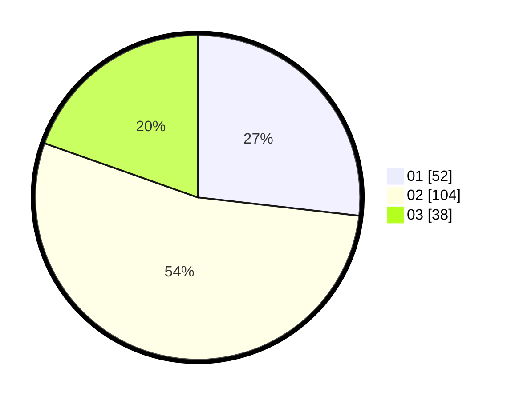

# Hasil

Hasil perolehan suara paslon dapat dilihat pada file paslon-01.txt, paslon-02.txt, dan paslon-03.txt.

Jika tidak ada, artinya data tersebut belum ada pada SIREKAP.

## Perolehan Suara

 * Paslon 01: **52**.
 * Paslon 02: **104**.
 * Paslon 03: **38**.

## Foto C Plano

https://sirekap-obj-formc.kpu.go.id/c662/pemilu/ppwp/31/71/08/10/04/3171081004031-20240215-025827--97038f56-fbfb-4693-acef-74d331f44e1e.jpg

https://sirekap-obj-formc.kpu.go.id/c662/pemilu/ppwp/31/71/08/10/04/3171081004031-20240215-025934--6f0615b6-ecaa-478e-a066-14c4779b6ae6.jpg

https://sirekap-obj-formc.kpu.go.id/c662/pemilu/ppwp/31/71/08/10/04/3171081004031-20240215-025958--8d750532-6fbb-4d43-8d5e-e09ec12bd7ff.jpg

## DATA PEMILIH TETAP

Jumlah pemilih dalam DPT: **273**.
 * L: **144**.
 * P: **129**.

## DATA PENGGUNA HAK PILIH

Jumlah pengguna hak pilih dalam DPT: **195**.
 * L: **100**.
 * P: **95**.

Jumlah pengguna hak pilih dalam DPTb: **0**.
 * L: **0**.
 * P: **0**.

Jumlah pengguna hak pilih dalam DPK: **1**.
 * L: **1**.
 * P: **0**.

Jumlah pengguna hak pilih: **196**.
 * L: **101**.
 * P: **95**.

## JUMLAH SUARA SAH DAN TIDAK SAH

JUMLAH SELURUH SUARA SAH: **194**.

JUMLAH SUARA TIDAK SAH: **2**.

JUMLAH SELURUH SUARA SAH DAN SUARA TIDAK SAH: **196**.
