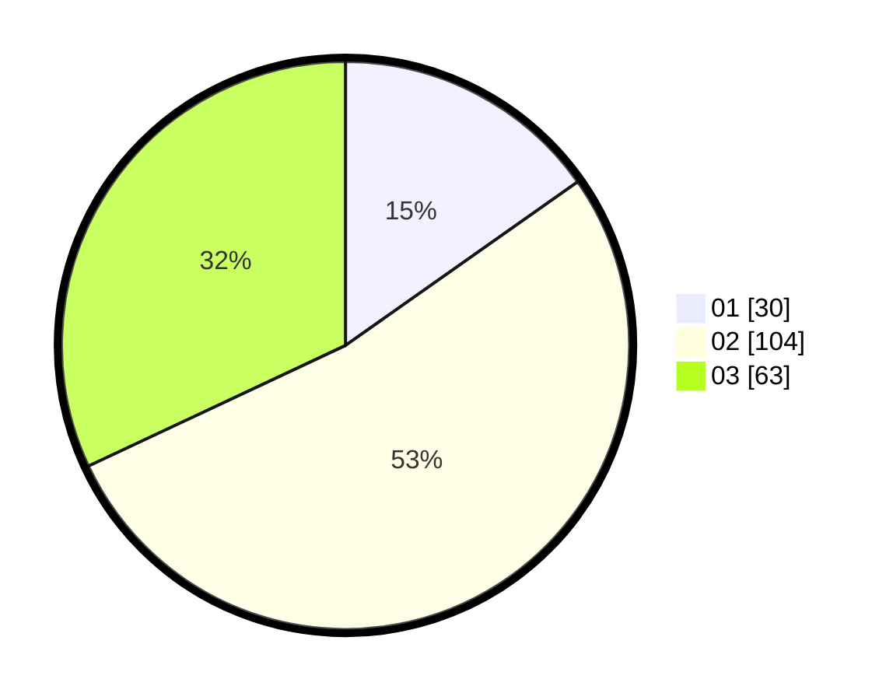

# Hasil

Hasil perolehan suara paslon dapat dilihat pada file paslon-01.txt, paslon-02.txt, dan paslon-03.txt.

Jika tidak ada, artinya data tersebut belum ada pada SIREKAP.

## Perolehan Suara

 * Paslon 01: **30**.
 * Paslon 02: **104**.
 * Paslon 03: **63**.

## Foto C Plano

https://sirekap-obj-formc.kpu.go.id/2dee/pemilu/ppwp/31/71/08/10/04/3171081004032-20240214-231855--592d9b03-1c90-4876-8990-2814617a84f7.jpg

https://sirekap-obj-formc.kpu.go.id/2dee/pemilu/ppwp/31/71/08/10/04/3171081004032-20240214-231950--04f21980-04c1-47a5-ac45-0c228cccfc67.jpg

https://sirekap-obj-formc.kpu.go.id/2dee/pemilu/ppwp/31/71/08/10/04/3171081004032-20240214-232047--1993b2ca-45d9-45da-b568-d7d1789250c3.jpg

## DATA PEMILIH TETAP

Jumlah pemilih dalam DPT: **275**.
 * L: **128**.
 * P: **147**.

## DATA PENGGUNA HAK PILIH

Jumlah pengguna hak pilih dalam DPT: **187**.
 * L: **94**.
 * P: **93**.

Jumlah pengguna hak pilih dalam DPTb: **2**.
 * L: **1**.
 * P: **1**.

Jumlah pengguna hak pilih dalam DPK: **8**.
 * L: **5**.
 * P: **3**.

Jumlah pengguna hak pilih: **197**.
 * L: **100**.
 * P: **97**.

## JUMLAH SUARA SAH DAN TIDAK SAH

JUMLAH SELURUH SUARA SAH: **197**.

JUMLAH SUARA TIDAK SAH: **4**.

JUMLAH SELURUH SUARA SAH DAN SUARA TIDAK SAH: **201**.
