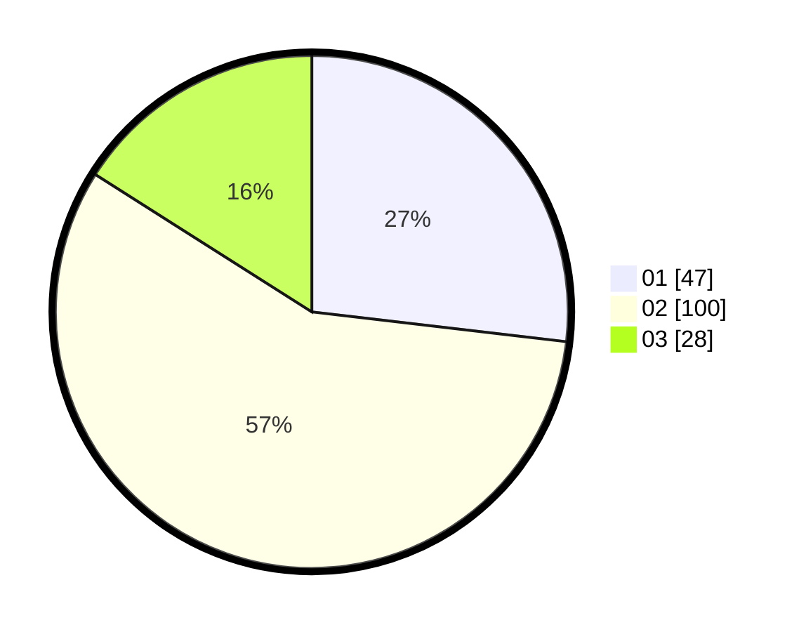

# Hasil

Hasil perolehan suara paslon dapat dilihat pada file paslon-01.txt, paslon-02.txt, dan paslon-03.txt.

Jika tidak ada, artinya data tersebut belum ada pada SIREKAP.

## Perolehan Suara

 * Paslon 01: **47**.
 * Paslon 02: **100**.
 * Paslon 03: **28**.

## Foto C Plano

https://sirekap-obj-formc.kpu.go.id/4da2/pemilu/ppwp/31/71/08/10/04/3171081004034-20240214-212945--b84e5293-af42-4424-a882-d639eed68826.jpg

https://sirekap-obj-formc.kpu.go.id/4da2/pemilu/ppwp/31/71/08/10/04/3171081004034-20240214-232740--d85fbde3-abf6-4bcc-a4f6-32656db5ef00.jpg

https://sirekap-obj-formc.kpu.go.id/4da2/pemilu/ppwp/31/71/08/10/04/3171081004034-20240214-203142--375f32a5-1f2f-43c1-a253-4b6d0774dce4.jpg

## DATA PEMILIH TETAP

Jumlah pemilih dalam DPT: **249**.
 * L: **142**.
 * P: **107**.

## DATA PENGGUNA HAK PILIH

Jumlah pengguna hak pilih dalam DPT: **182**.
 * L: **96**.
 * P: **86**.

Jumlah pengguna hak pilih dalam DPTb: **0**.
 * L: **0**.
 * P: **0**.

Jumlah pengguna hak pilih dalam DPK: **0**.
 * L: **0**.
 * P: **0**.

Jumlah pengguna hak pilih: **182**.
 * L: **96**.
 * P: **86**.

## JUMLAH SUARA SAH DAN TIDAK SAH

JUMLAH SELURUH SUARA SAH: **175**.

JUMLAH SUARA TIDAK SAH: **7**.

JUMLAH SELURUH SUARA SAH DAN SUARA TIDAK SAH: **182**.
