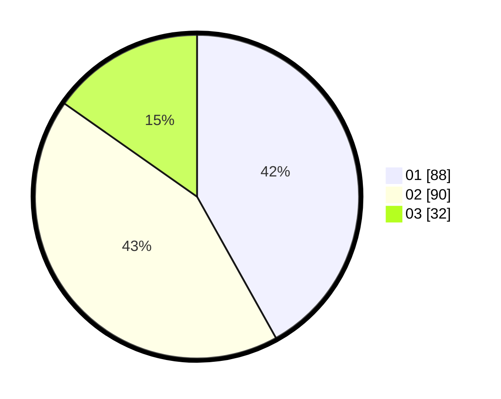

# Hasil

Hasil perolehan suara paslon dapat dilihat pada file paslon-01.txt, paslon-02.txt, dan paslon-03.txt.

Jika tidak ada, artinya data tersebut belum ada pada SIREKAP.

## Perolehan Suara

 * Paslon 01: **88**.
 * Paslon 02: **90**.
 * Paslon 03: **32**.

## Foto C Plano

https://sirekap-obj-formc.kpu.go.id/b057/pemilu/ppwp/31/71/08/10/04/3171081004041-20240216-233958--ade75809-7d97-43f4-99b4-7dc06779ec74.jpg

https://sirekap-obj-formc.kpu.go.id/b057/pemilu/ppwp/31/71/08/10/04/3171081004041-20240216-234000--9fe8a367-1663-4845-836a-b93ba2ff6f66.jpg

https://sirekap-obj-formc.kpu.go.id/b057/pemilu/ppwp/31/71/08/10/04/3171081004041-20240216-233959--658dd9e7-32bd-4b6f-acb0-87172be773a0.jpg

## DATA PEMILIH TETAP

Jumlah pemilih dalam DPT: **252**.
 * L: **125**.
 * P: **127**.

## DATA PENGGUNA HAK PILIH

Jumlah pengguna hak pilih dalam DPT: **211**.
 * L: **102**.
 * P: **109**.

Jumlah pengguna hak pilih dalam DPTb: **3**.
 * L: **1**.
 * P: **2**.

Jumlah pengguna hak pilih dalam DPK: **2**.
 * L: **1**.
 * P: **1**.

Jumlah pengguna hak pilih: **216**.
 * L: **104**.
 * P: **112**.

## JUMLAH SUARA SAH DAN TIDAK SAH

JUMLAH SELURUH SUARA SAH: **210**.

JUMLAH SUARA TIDAK SAH: **6**.

JUMLAH SELURUH SUARA SAH DAN SUARA TIDAK SAH: **216**.
