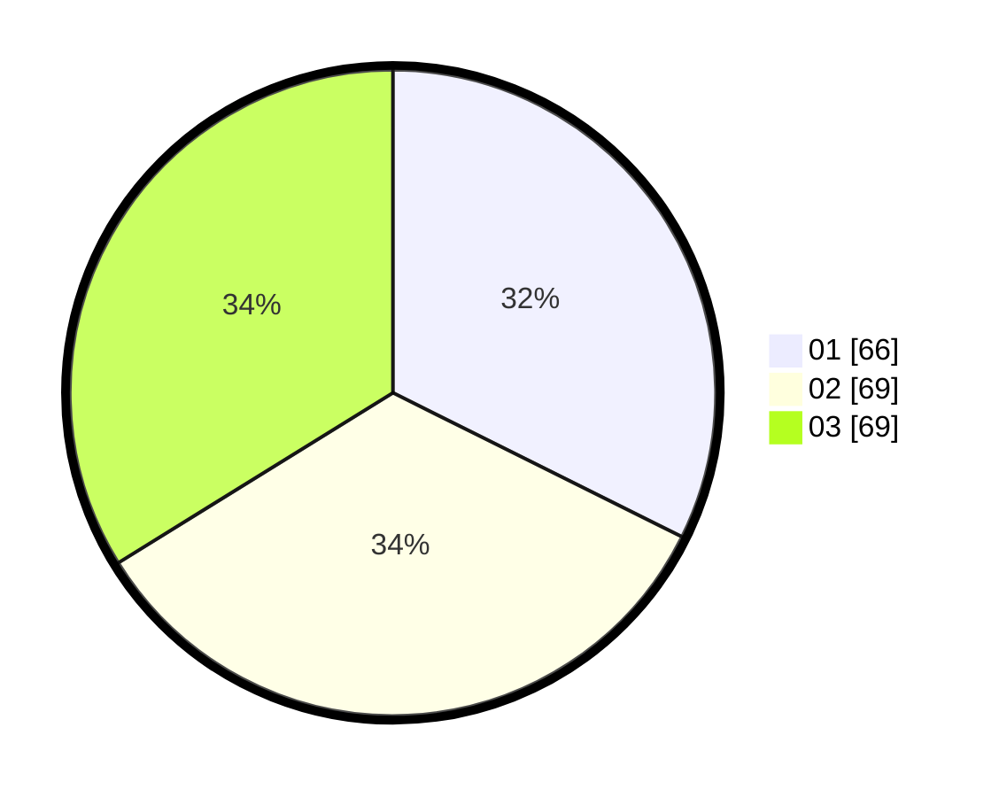

# Hasil

Hasil perolehan suara paslon dapat dilihat pada file paslon-01.txt, paslon-02.txt, dan paslon-03.txt.

Jika tidak ada, artinya data tersebut belum ada pada SIREKAP.

## Perolehan Suara

 * Paslon 01: **66**.
 * Paslon 02: **69**.
 * Paslon 03: **69**.

## Foto C Plano

https://sirekap-obj-formc.kpu.go.id/aedc/pemilu/ppwp/31/71/08/10/04/3171081004045-20240214-220006--4eaacd98-6907-4a45-8730-dd9a786ce9dd.jpg

https://sirekap-obj-formc.kpu.go.id/aedc/pemilu/ppwp/31/71/08/10/04/3171081004045-20240214-203631--ad835d1a-945c-4b6b-905d-82d7bef96109.jpg

https://sirekap-obj-formc.kpu.go.id/aedc/pemilu/ppwp/31/71/08/10/04/3171081004045-20240214-220106--004d9234-9b38-460f-ae66-0b12f8cad0d5.jpg
