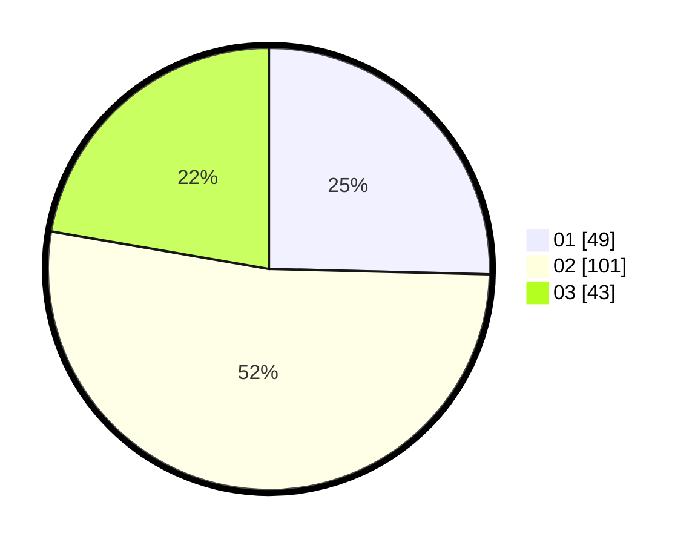

# Hasil

Hasil perolehan suara paslon dapat dilihat pada file paslon-01.txt, paslon-02.txt, dan paslon-03.txt.

Jika tidak ada, artinya data tersebut belum ada pada SIREKAP.

## Perolehan Suara

 * Paslon 01: **49**.
 * Paslon 02: **101**.
 * Paslon 03: **43**.

## Foto C Plano

https://sirekap-obj-formc.kpu.go.id/338a/pemilu/ppwp/31/71/08/10/04/3171081004046-20240216-220131--72458c57-5304-4951-88a2-6d0c97fa1ff9.jpg

https://sirekap-obj-formc.kpu.go.id/338a/pemilu/ppwp/31/71/08/10/04/3171081004046-20240216-220225--ae81c133-5006-4e7e-9fb4-f9387d48ba85.jpg
