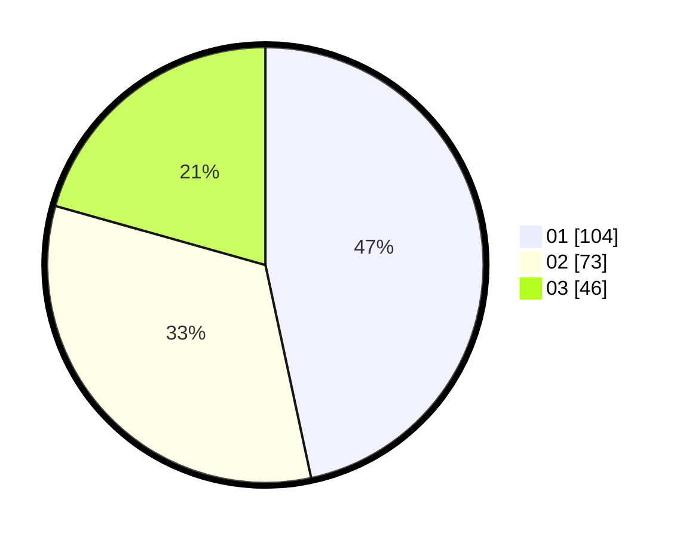

# Hasil

Hasil perolehan suara paslon dapat dilihat pada file paslon-01.txt, paslon-02.txt, dan paslon-03.txt.

Jika tidak ada, artinya data tersebut belum ada pada SIREKAP.

## Perolehan Suara

 * Paslon 01: **104**.
 * Paslon 02: **73**.
 * Paslon 03: **46**.

## Foto C Plano

https://sirekap-obj-formc.kpu.go.id/c4b0/pemilu/ppwp/31/71/08/10/04/3171081004047-20240215-204341--5a53f2df-9692-4851-b445-0ba820bfc1f7.jpg

https://sirekap-obj-formc.kpu.go.id/c4b0/pemilu/ppwp/31/71/08/10/04/3171081004047-20240215-204342--057432eb-241f-49c3-a4b3-243e7f866fb8.jpg

https://sirekap-obj-formc.kpu.go.id/c4b0/pemilu/ppwp/31/71/08/10/04/3171081004047-20240215-204341--d067721d-21e7-415e-a6cf-2e39161866da.jpg

## DATA PEMILIH TETAP

Jumlah pemilih dalam DPT: **284**.
 * L: **140**.
 * P: **144**.

## DATA PENGGUNA HAK PILIH

Jumlah pengguna hak pilih dalam DPT: **220**.
 * L: **108**.
 * P: **112**.

Jumlah pengguna hak pilih dalam DPTb: **7**.
 * L: **6**.
 * P: **1**.

Jumlah pengguna hak pilih dalam DPK: **0**.
 * L: **0**.
 * P: **0**.

Jumlah pengguna hak pilih: **227**.
 * L: **114**.
 * P: **113**.

## JUMLAH SUARA SAH DAN TIDAK SAH

JUMLAH SELURUH SUARA SAH: **223**.

JUMLAH SUARA TIDAK SAH: **4**.

JUMLAH SELURUH SUARA SAH DAN SUARA TIDAK SAH: **227**.
