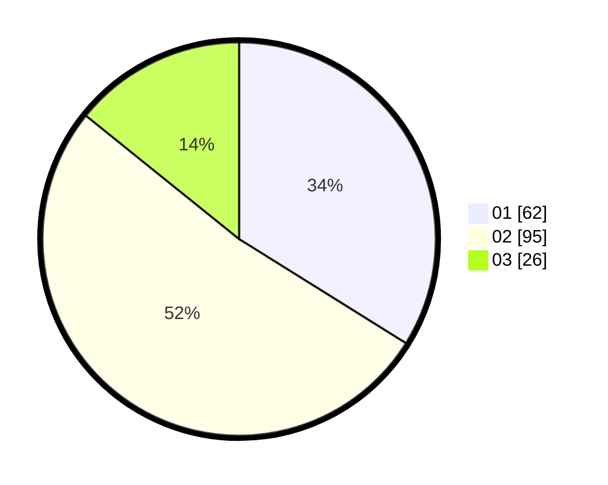

# Hasil

Hasil perolehan suara paslon dapat dilihat pada file paslon-01.txt, paslon-02.txt, dan paslon-03.txt.

Jika tidak ada, artinya data tersebut belum ada pada SIREKAP.

## Perolehan Suara

 * Paslon 01: **62**.
 * Paslon 02: **95**.
 * Paslon 03: **26**.

## Foto C Plano

https://sirekap-obj-formc.kpu.go.id/6566/pemilu/ppwp/31/71/08/10/04/3171081004048-20240215-145659--faf945ef-866c-4723-aadb-bfbe4642b102.jpg

https://sirekap-obj-formc.kpu.go.id/6566/pemilu/ppwp/31/71/08/10/04/3171081004048-20240214-202420--bcc87529-2255-40a6-9c41-9800fc95fb8d.jpg

https://sirekap-obj-formc.kpu.go.id/6566/pemilu/ppwp/31/71/08/10/04/3171081004048-20240215-145710--c069a848-c197-4864-86a5-a616166b0ee3.jpg

## DATA PEMILIH TETAP

Jumlah pemilih dalam DPT: **266**.
 * L: **131**.
 * P: **135**.

## DATA PENGGUNA HAK PILIH

Jumlah pengguna hak pilih dalam DPT: **181**.
 * L: **79**.
 * P: **102**.

Jumlah pengguna hak pilih dalam DPTb: **3**.
 * L: **1**.
 * P: **2**.

Jumlah pengguna hak pilih dalam DPK: **1**.
 * L: **0**.
 * P: **1**.

Jumlah pengguna hak pilih: **185**.
 * L: **80**.
 * P: **105**.

## JUMLAH SUARA SAH DAN TIDAK SAH

JUMLAH SELURUH SUARA SAH: **183**.

JUMLAH SUARA TIDAK SAH: **2**.

JUMLAH SELURUH SUARA SAH DAN SUARA TIDAK SAH: **185**.
