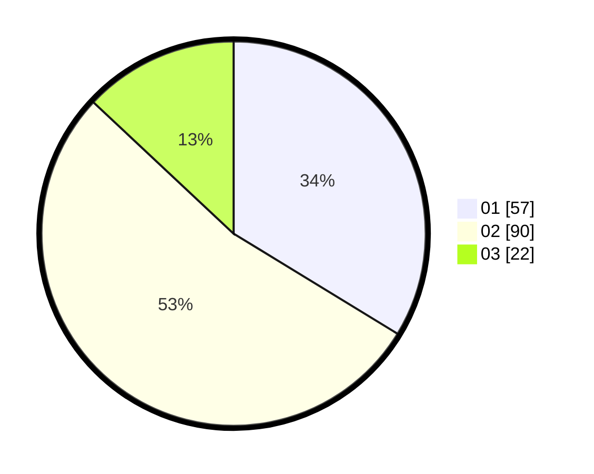

# Hasil

Hasil perolehan suara paslon dapat dilihat pada file paslon-01.txt, paslon-02.txt, dan paslon-03.txt.

Jika tidak ada, artinya data tersebut belum ada pada SIREKAP.

## Perolehan Suara

 * Paslon 01: **57**.
 * Paslon 02: **90**.
 * Paslon 03: **22**.

## Foto C Plano

https://sirekap-obj-formc.kpu.go.id/6d9f/pemilu/ppwp/31/71/08/10/04/3171081004050-20240214-220003--79637e32-df97-42ee-9fc1-5065390efcab.jpg

https://sirekap-obj-formc.kpu.go.id/6d9f/pemilu/ppwp/31/71/08/10/04/3171081004050-20240214-205348--718b723f-31cc-4fe2-ac7c-71dec7678093.jpg

https://sirekap-obj-formc.kpu.go.id/6d9f/pemilu/ppwp/31/71/08/10/04/3171081004050-20240214-220126--85f9d8b2-9e9c-41aa-99e9-a623a3205f41.jpg

## DATA PEMILIH TETAP

Jumlah pemilih dalam DPT: **242**.
 * L: **116**.
 * P: **126**.

## DATA PENGGUNA HAK PILIH

Jumlah pengguna hak pilih dalam DPT: **170**.
 * L: **79**.
 * P: **91**.

Jumlah pengguna hak pilih dalam DPTb: **0**.
 * L: **0**.
 * P: **0**.

Jumlah pengguna hak pilih dalam DPK: **0**.
 * L: **0**.
 * P: **0**.

Jumlah pengguna hak pilih: **170**.
 * L: **79**.
 * P: **91**.

## JUMLAH SUARA SAH DAN TIDAK SAH

JUMLAH SELURUH SUARA SAH: **169**.

JUMLAH SUARA TIDAK SAH: **1**.

JUMLAH SELURUH SUARA SAH DAN SUARA TIDAK SAH: **170**.
