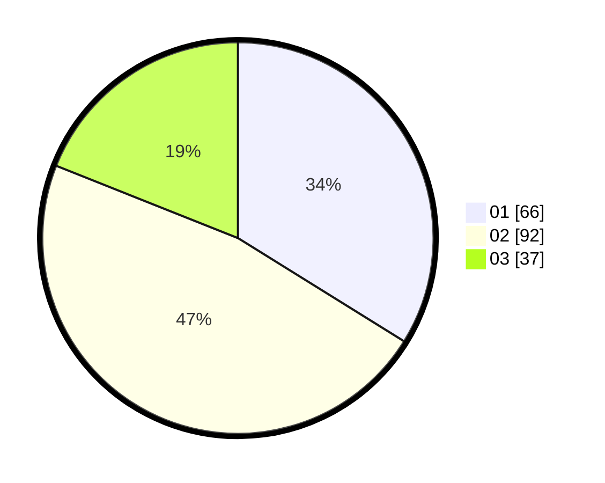

# Hasil

Hasil perolehan suara paslon dapat dilihat pada file paslon-01.txt, paslon-02.txt, dan paslon-03.txt.

Jika tidak ada, artinya data tersebut belum ada pada SIREKAP.

## Perolehan Suara

 * Paslon 01: **66**.
 * Paslon 02: **92**.
 * Paslon 03: **37**.

## Foto C Plano

https://sirekap-obj-formc.kpu.go.id/c931/pemilu/ppwp/31/71/08/10/04/3171081004053-20240214-155901--1e26bbdc-e095-4e7d-b2c1-ad3be3205170.jpg

https://sirekap-obj-formc.kpu.go.id/c931/pemilu/ppwp/31/71/08/10/04/3171081004053-20240214-155714--941c48b8-1e86-4558-a5b3-5a5f591c530f.jpg

https://sirekap-obj-formc.kpu.go.id/c931/pemilu/ppwp/31/71/08/10/04/3171081004053-20240214-160059--cab7ec6b-9f00-44e1-bc3a-e80a6bab64d1.jpg

## DATA PEMILIH TETAP

Jumlah pemilih dalam DPT: **257**.
 * L: **130**.
 * P: **127**.

## DATA PENGGUNA HAK PILIH

Jumlah pengguna hak pilih dalam DPT: **197**.
 * L: **95**.
 * P: **102**.

Jumlah pengguna hak pilih dalam DPTb: **0**.
 * L: **0**.
 * P: **0**.

Jumlah pengguna hak pilih dalam DPK: **0**.
 * L: **0**.
 * P: **0**.

Jumlah pengguna hak pilih: **197**.
 * L: **95**.
 * P: **102**.

## JUMLAH SUARA SAH DAN TIDAK SAH

JUMLAH SELURUH SUARA SAH: **195**.

JUMLAH SUARA TIDAK SAH: **2**.

JUMLAH SELURUH SUARA SAH DAN SUARA TIDAK SAH: **197**.
