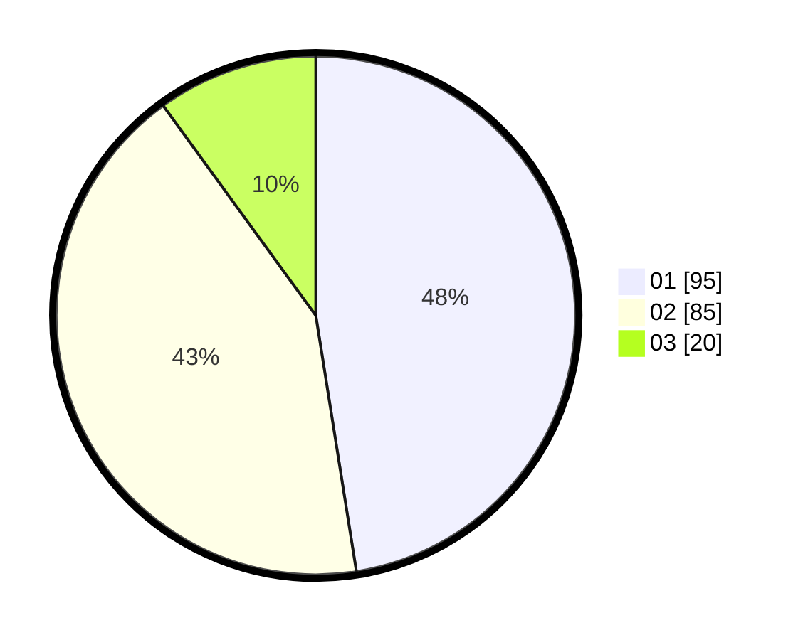

# Hasil

Hasil perolehan suara paslon dapat dilihat pada file paslon-01.txt, paslon-02.txt, dan paslon-03.txt.

Jika tidak ada, artinya data tersebut belum ada pada SIREKAP.

## Perolehan Suara

 * Paslon 01: **95**.
 * Paslon 02: **85**.
 * Paslon 03: **20**.

## Foto C Plano

https://sirekap-obj-formc.kpu.go.id/00ab/pemilu/ppwp/31/71/08/10/04/3171081004057-20240214-203107--ee1ab8d2-1341-4f79-ae21-b92e65944725.jpg

https://sirekap-obj-formc.kpu.go.id/00ab/pemilu/ppwp/31/71/08/10/04/3171081004057-20240214-203111--ed88a0fc-b9b4-4b71-8215-61e51109d11e.jpg

https://sirekap-obj-formc.kpu.go.id/00ab/pemilu/ppwp/31/71/08/10/04/3171081004057-20240214-203115--02cc14fb-1c39-4b5c-a378-2fe65c251c86.jpg
