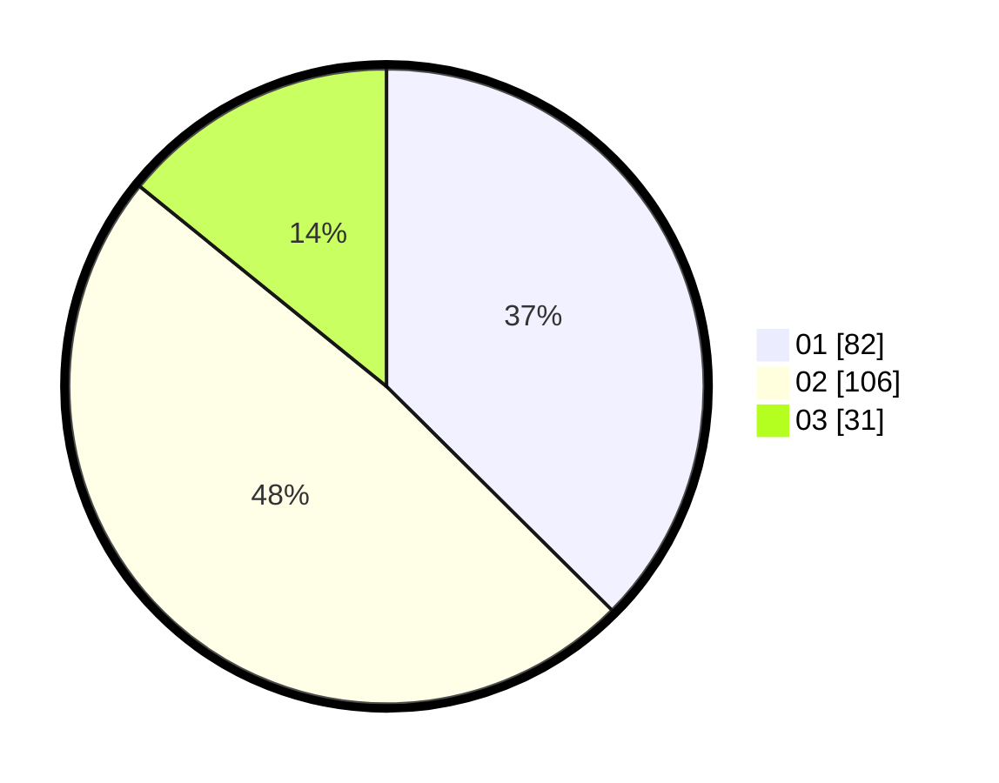

# Hasil

Hasil perolehan suara paslon dapat dilihat pada file paslon-01.txt, paslon-02.txt, dan paslon-03.txt.

Jika tidak ada, artinya data tersebut belum ada pada SIREKAP.

## Perolehan Suara

 * Paslon 01: **82**.
 * Paslon 02: **106**.
 * Paslon 03: **31**.

## Foto C Plano

https://sirekap-obj-formc.kpu.go.id/58d2/pemilu/ppwp/31/71/08/10/04/3171081004058-20240215-000323--431e7bf2-7f3c-4c66-93bb-d684495e0b8b.jpg

https://sirekap-obj-formc.kpu.go.id/58d2/pemilu/ppwp/31/71/08/10/04/3171081004058-20240215-000434--31ee18ea-cb88-4ea2-9663-6cf6e1d8d9b7.jpg

https://sirekap-obj-formc.kpu.go.id/58d2/pemilu/ppwp/31/71/08/10/04/3171081004058-20240215-000506--b8734320-1159-4d62-85d3-f8f57cf020eb.jpg

## DATA PEMILIH TETAP

Jumlah pemilih dalam DPT: **260**.
 * L: **133**.
 * P: **127**.

## DATA PENGGUNA HAK PILIH

Jumlah pengguna hak pilih dalam DPT: **220**.
 * L: **113**.
 * P: **107**.

Jumlah pengguna hak pilih dalam DPTb: **1**.
 * L: **0**.
 * P: **1**.

Jumlah pengguna hak pilih dalam DPK: **0**.
 * L: **0**.
 * P: **0**.

Jumlah pengguna hak pilih: **221**.
 * L: **113**.
 * P: **108**.

## JUMLAH SUARA SAH DAN TIDAK SAH

JUMLAH SELURUH SUARA SAH: **219**.

JUMLAH SUARA TIDAK SAH: **2**.

JUMLAH SELURUH SUARA SAH DAN SUARA TIDAK SAH: **221**.
