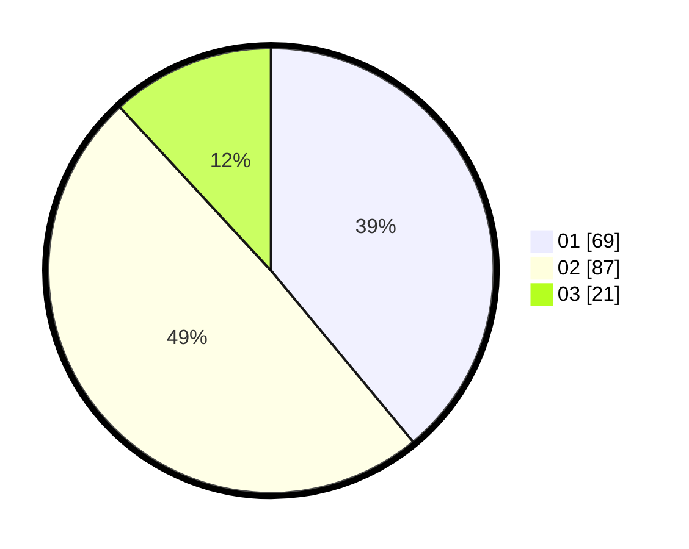

# Hasil

Hasil perolehan suara paslon dapat dilihat pada file paslon-01.txt, paslon-02.txt, dan paslon-03.txt.

Jika tidak ada, artinya data tersebut belum ada pada SIREKAP.

## Perolehan Suara

 * Paslon 01: **69**.
 * Paslon 02: **87**.
 * Paslon 03: **21**.

## Foto C Plano

https://sirekap-obj-formc.kpu.go.id/fa06/pemilu/ppwp/31/71/08/10/04/3171081004063-20240217-122504--2a3ec7c1-09ab-47ac-aeec-894fd93ab35c.jpg

https://sirekap-obj-formc.kpu.go.id/fa06/pemilu/ppwp/31/71/08/10/04/3171081004063-20240217-124137--6e133a9f-0504-4599-9335-2e1b8c6baae2.jpg

https://sirekap-obj-formc.kpu.go.id/fa06/pemilu/ppwp/31/71/08/10/04/3171081004063-20240217-123732--a2d6b3fa-b5e0-4e41-afc2-b970bd6cbe4c.jpg

## DATA PEMILIH TETAP

Jumlah pemilih dalam DPT: **247**.
 * L: **123**.
 * P: **124**.

## DATA PENGGUNA HAK PILIH

Jumlah pengguna hak pilih dalam DPT: **180**.
 * L: **81**.
 * P: **99**.

Jumlah pengguna hak pilih dalam DPTb: **0**.
 * L: **0**.
 * P: **0**.

Jumlah pengguna hak pilih dalam DPK: **0**.
 * L: **0**.
 * P: **0**.

Jumlah pengguna hak pilih: **180**.
 * L: **81**.
 * P: **99**.

## JUMLAH SUARA SAH DAN TIDAK SAH

JUMLAH SELURUH SUARA SAH: **177**.

JUMLAH SUARA TIDAK SAH: **3**.

JUMLAH SELURUH SUARA SAH DAN SUARA TIDAK SAH: **180**.
