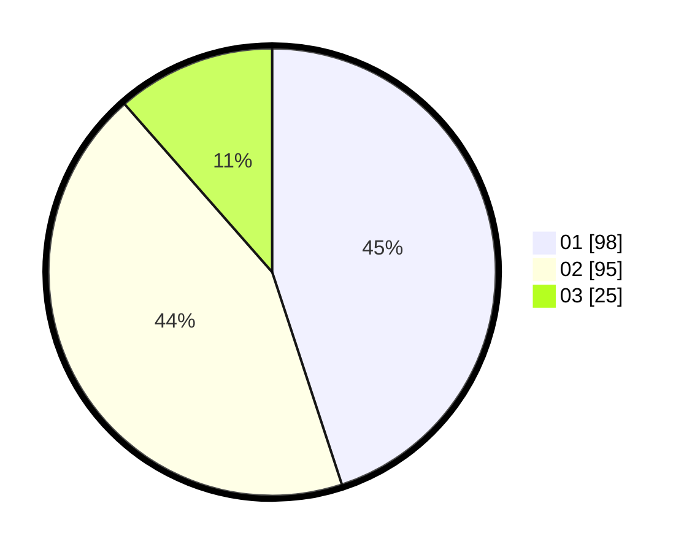

# Hasil

Hasil perolehan suara paslon dapat dilihat pada file paslon-01.txt, paslon-02.txt, dan paslon-03.txt.

Jika tidak ada, artinya data tersebut belum ada pada SIREKAP.

## Perolehan Suara

 * Paslon 01: **98**.
 * Paslon 02: **95**.
 * Paslon 03: **25**.

## Foto C Plano

https://sirekap-obj-formc.kpu.go.id/90ef/pemilu/ppwp/31/71/08/10/04/3171081004064-20240216-115403--4e658f43-54c4-46a6-b8a2-d76ee2b3e40f.jpg

https://sirekap-obj-formc.kpu.go.id/90ef/pemilu/ppwp/31/71/08/10/04/3171081004064-20240216-115513--8954e659-db89-4c3d-948a-25f5e97447ae.jpg
