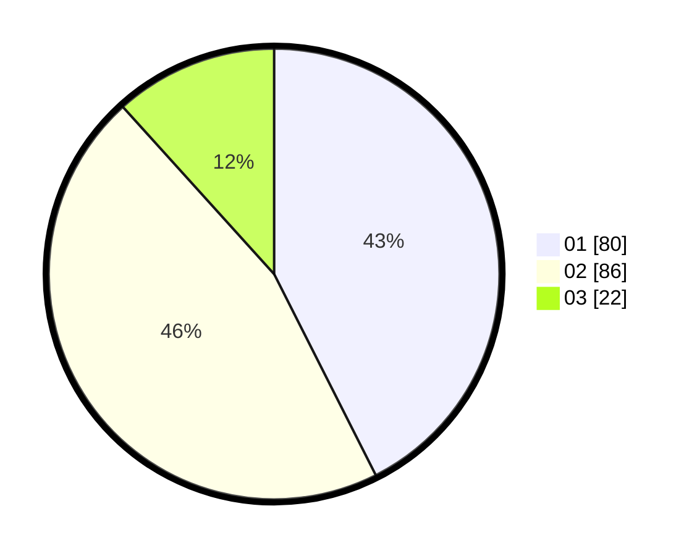

# Hasil

Hasil perolehan suara paslon dapat dilihat pada file paslon-01.txt, paslon-02.txt, dan paslon-03.txt.

Jika tidak ada, artinya data tersebut belum ada pada SIREKAP.

## Perolehan Suara

 * Paslon 01: **80**.
 * Paslon 02: **86**.
 * Paslon 03: **22**.

## Foto C Plano

https://sirekap-obj-formc.kpu.go.id/80fd/pemilu/ppwp/31/71/08/10/04/3171081004066-20240215-212610--db2f3d9d-61e0-46f7-88b1-1348016aeea3.jpg

https://sirekap-obj-formc.kpu.go.id/80fd/pemilu/ppwp/31/71/08/10/04/3171081004066-20240215-212613--51a60f57-f674-4ba8-b742-5e475b3e871e.jpg

https://sirekap-obj-formc.kpu.go.id/80fd/pemilu/ppwp/31/71/08/10/04/3171081004066-20240215-212611--0c652884-2629-4548-b01c-255a8e7338d1.jpg

## DATA PEMILIH TETAP

Jumlah pemilih dalam DPT: **253**.
 * L: **130**.
 * P: **123**.

## DATA PENGGUNA HAK PILIH

Jumlah pengguna hak pilih dalam DPT: **185**.
 * L: **90**.
 * P: **95**.

Jumlah pengguna hak pilih dalam DPTb: **2**.
 * L: **1**.
 * P: **1**.

Jumlah pengguna hak pilih dalam DPK: **2**.
 * L: **1**.
 * P: **1**.

Jumlah pengguna hak pilih: **189**.
 * L: **92**.
 * P: **97**.

## JUMLAH SUARA SAH DAN TIDAK SAH

JUMLAH SELURUH SUARA SAH: **188**.

JUMLAH SUARA TIDAK SAH: **2**.

JUMLAH SELURUH SUARA SAH DAN SUARA TIDAK SAH: **190**.
