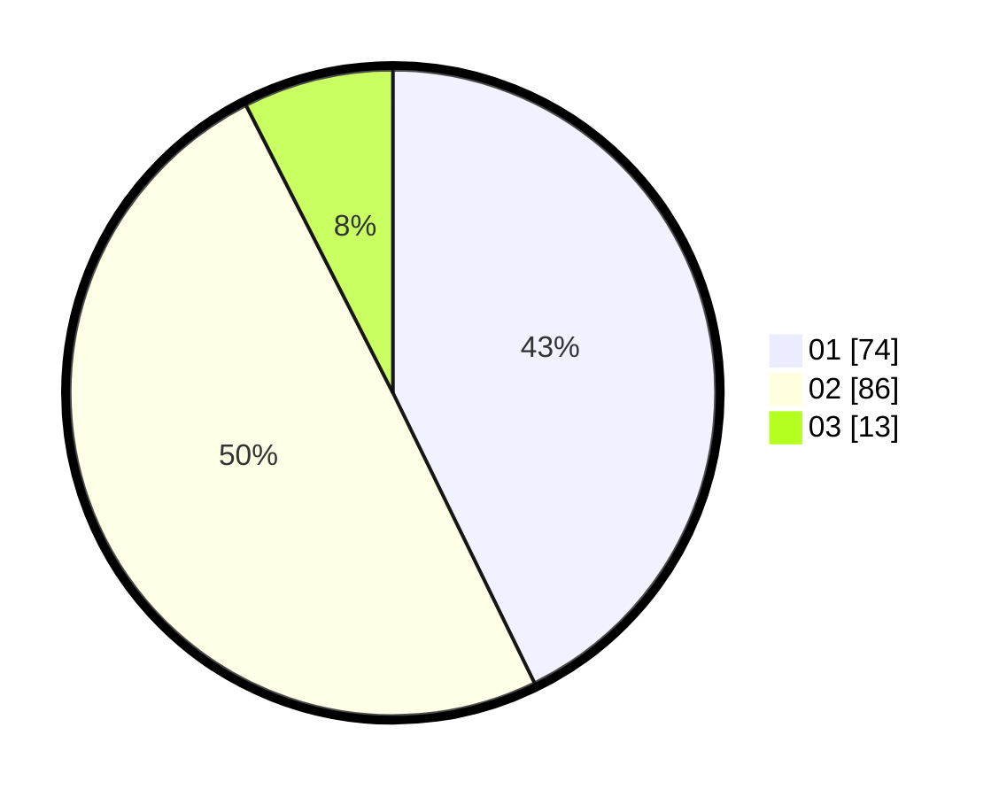

# Hasil

Hasil perolehan suara paslon dapat dilihat pada file paslon-01.txt, paslon-02.txt, dan paslon-03.txt.

Jika tidak ada, artinya data tersebut belum ada pada SIREKAP.

## Perolehan Suara

 * Paslon 01: **74**.
 * Paslon 02: **86**.
 * Paslon 03: **13**.

## Foto C Plano

https://sirekap-obj-formc.kpu.go.id/2ce0/pemilu/ppwp/31/71/08/10/04/3171081004069-20240216-154309--c526391e-1a42-49f0-88d0-d9cf72d81c81.jpg

https://sirekap-obj-formc.kpu.go.id/2ce0/pemilu/ppwp/31/71/08/10/04/3171081004069-20240216-154310--6b6a9787-1335-4ac9-8de5-d4b2a913da15.jpg

https://sirekap-obj-formc.kpu.go.id/2ce0/pemilu/ppwp/31/71/08/10/04/3171081004069-20240216-154309--58f37bc7-6dbb-46a7-bc2d-7dc63a177e57.jpg

## DATA PEMILIH TETAP

Jumlah pemilih dalam DPT: **249**.
 * L: **135**.
 * P: **114**.

## DATA PENGGUNA HAK PILIH

Jumlah pengguna hak pilih dalam DPT: **176**.
 * L: **94**.
 * P: **82**.

Jumlah pengguna hak pilih dalam DPTb: **0**.
 * L: **0**.
 * P: **0**.

Jumlah pengguna hak pilih dalam DPK: **0**.
 * L: **0**.
 * P: **1**.

Jumlah pengguna hak pilih: **177**.
 * L: **94**.
 * P: **83**.

## JUMLAH SUARA SAH DAN TIDAK SAH

JUMLAH SELURUH SUARA SAH: **173**.

JUMLAH SUARA TIDAK SAH: **4**.

JUMLAH SELURUH SUARA SAH DAN SUARA TIDAK SAH: **177**.
