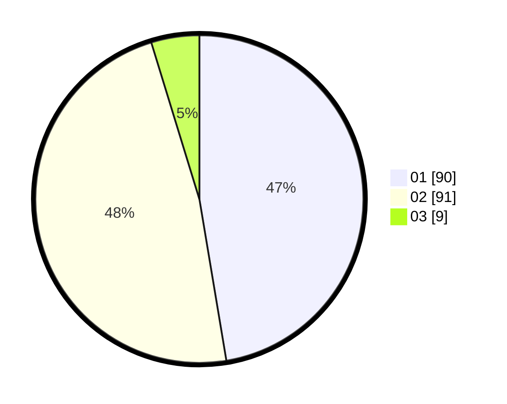

# Hasil

Hasil perolehan suara paslon dapat dilihat pada file paslon-01.txt, paslon-02.txt, dan paslon-03.txt.

Jika tidak ada, artinya data tersebut belum ada pada SIREKAP.

## Perolehan Suara

 * Paslon 01: **90**.
 * Paslon 02: **91**.
 * Paslon 03: **9**.

## Foto C Plano

https://sirekap-obj-formc.kpu.go.id/13e2/pemilu/ppwp/31/71/08/10/04/3171081004070-20240216-004407--1991e5a6-37db-4cbc-998e-a539202f95f4.jpg

https://sirekap-obj-formc.kpu.go.id/13e2/pemilu/ppwp/31/71/08/10/04/3171081004070-20240214-155023--d7d52d98-70ff-48af-afca-5eb4319515c6.jpg

https://sirekap-obj-formc.kpu.go.id/13e2/pemilu/ppwp/31/71/08/10/04/3171081004070-20240216-004408--ebf5d56b-b79b-4e95-a49f-01424f58fc6a.jpg

## DATA PEMILIH TETAP

Jumlah pemilih dalam DPT: **260**.
 * L: **141**.
 * P: **119**.

## DATA PENGGUNA HAK PILIH

Jumlah pengguna hak pilih dalam DPT: **194**.
 * L: **105**.
 * P: **89**.

Jumlah pengguna hak pilih dalam DPTb: **1**.
 * L: **0**.
 * P: **1**.

Jumlah pengguna hak pilih dalam DPK: **1**.
 * L: **0**.
 * P: **1**.

Jumlah pengguna hak pilih: **196**.
 * L: **105**.
 * P: **91**.

## JUMLAH SUARA SAH DAN TIDAK SAH

JUMLAH SELURUH SUARA SAH: **190**.

JUMLAH SUARA TIDAK SAH: **6**.

JUMLAH SELURUH SUARA SAH DAN SUARA TIDAK SAH: **196**.
