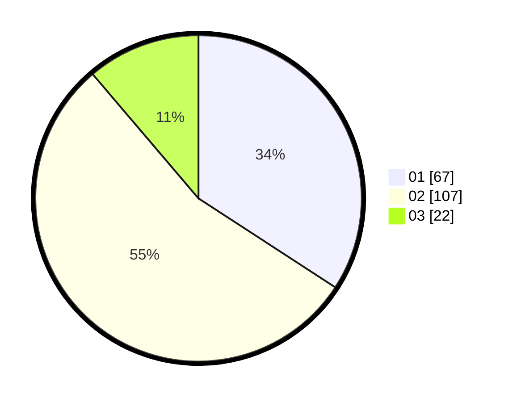

# Hasil

Hasil perolehan suara paslon dapat dilihat pada file paslon-01.txt, paslon-02.txt, dan paslon-03.txt.

Jika tidak ada, artinya data tersebut belum ada pada SIREKAP.

## Perolehan Suara

 * Paslon 01: **67**.
 * Paslon 02: **107**.
 * Paslon 03: **22**.

## Foto C Plano

https://sirekap-obj-formc.kpu.go.id/912e/pemilu/ppwp/31/71/08/10/04/3171081004071-20240217-112637--edf3d271-c5ea-4a57-8f99-5ad00f4b6d4d.jpg

https://sirekap-obj-formc.kpu.go.id/912e/pemilu/ppwp/31/71/08/10/04/3171081004071-20240217-112638--90c4cf1a-20a5-4b65-934c-11e3c4ea1005.jpg

https://sirekap-obj-formc.kpu.go.id/912e/pemilu/ppwp/31/71/08/10/04/3171081004071-20240217-112637--99f93d48-71a9-4094-ae15-3b23675da4a9.jpg

## DATA PEMILIH TETAP

Jumlah pemilih dalam DPT: **258**.
 * L: **133**.
 * P: **125**.

## DATA PENGGUNA HAK PILIH

Jumlah pengguna hak pilih dalam DPT: **201**.
 * L: **103**.
 * P: **98**.

Jumlah pengguna hak pilih dalam DPTb: **1**.
 * L: **0**.
 * P: **1**.

Jumlah pengguna hak pilih dalam DPK: **0**.
 * L: **0**.
 * P: **0**.

Jumlah pengguna hak pilih: **202**.
 * L: **103**.
 * P: **99**.

## JUMLAH SUARA SAH DAN TIDAK SAH

JUMLAH SELURUH SUARA SAH: **196**.

JUMLAH SUARA TIDAK SAH: **6**.

JUMLAH SELURUH SUARA SAH DAN SUARA TIDAK SAH: **202**.
