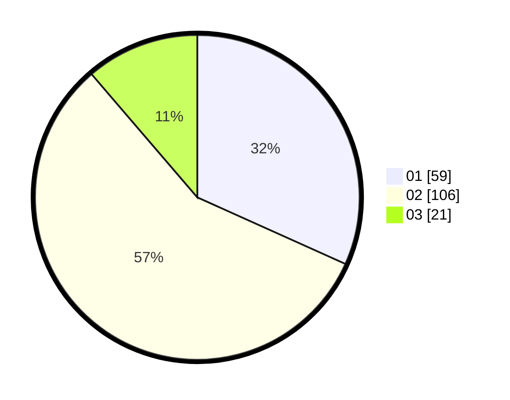

# Hasil

Hasil perolehan suara paslon dapat dilihat pada file paslon-01.txt, paslon-02.txt, dan paslon-03.txt.

Jika tidak ada, artinya data tersebut belum ada pada SIREKAP.

## Perolehan Suara

 * Paslon 01: **59**.
 * Paslon 02: **106**.
 * Paslon 03: **21**.

## Foto C Plano

https://sirekap-obj-formc.kpu.go.id/4510/pemilu/ppwp/31/71/08/10/04/3171081004072-20240215-021026--3b96ac12-bd28-4499-9327-5f00a9e24cef.jpg

https://sirekap-obj-formc.kpu.go.id/4510/pemilu/ppwp/31/71/08/10/04/3171081004072-20240215-001013--74846c6f-aec9-4814-bbd6-530bd4222f81.jpg

https://sirekap-obj-formc.kpu.go.id/4510/pemilu/ppwp/31/71/08/10/04/3171081004072-20240215-001840--6f1ed82b-e1f0-49f4-8e9b-cc7beb1f20a2.jpg

## DATA PEMILIH TETAP

Jumlah pemilih dalam DPT: **266**.
 * L: **139**.
 * P: **127**.

## DATA PENGGUNA HAK PILIH

Jumlah pengguna hak pilih dalam DPT: **188**.
 * L: **98**.
 * P: **90**.

Jumlah pengguna hak pilih dalam DPTb: **1**.
 * L: **0**.
 * P: **1**.

Jumlah pengguna hak pilih dalam DPK: **2**.
 * L: **2**.
 * P: **0**.

Jumlah pengguna hak pilih: **191**.
 * L: **100**.
 * P: **91**.

## JUMLAH SUARA SAH DAN TIDAK SAH

JUMLAH SELURUH SUARA SAH: **186**.

JUMLAH SUARA TIDAK SAH: **5**.

JUMLAH SELURUH SUARA SAH DAN SUARA TIDAK SAH: **191**.
