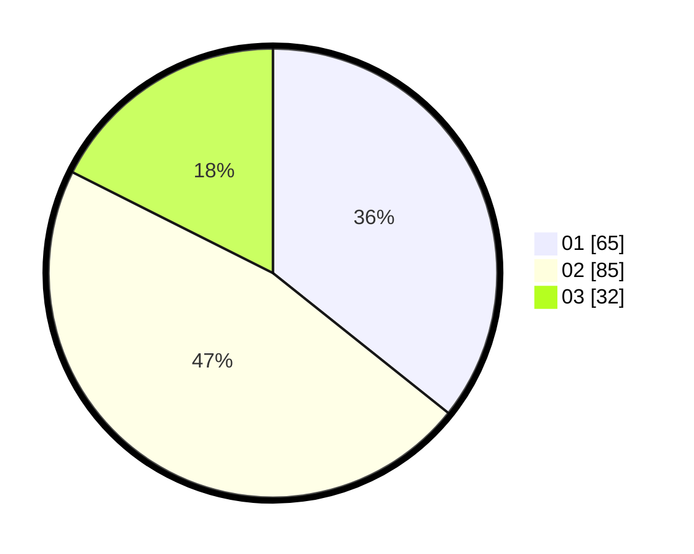

# Hasil

Hasil perolehan suara paslon dapat dilihat pada file paslon-01.txt, paslon-02.txt, dan paslon-03.txt.

Jika tidak ada, artinya data tersebut belum ada pada SIREKAP.

## Perolehan Suara

 * Paslon 01: **65**.
 * Paslon 02: **85**.
 * Paslon 03: **32**.

## Foto C Plano

https://sirekap-obj-formc.kpu.go.id/b6e3/pemilu/ppwp/31/71/08/10/04/3171081004077-20240215-003628--c0815da9-a9a0-47c1-9463-fd0f2526e2cf.jpg

https://sirekap-obj-formc.kpu.go.id/b6e3/pemilu/ppwp/31/71/08/10/04/3171081004077-20240215-003743--a1642faa-a9b3-40e4-86f7-f4cfea14344e.jpg

https://sirekap-obj-formc.kpu.go.id/b6e3/pemilu/ppwp/31/71/08/10/04/3171081004077-20240215-005712--022b0b4c-254a-43b5-b266-240cc4d8b105.jpg

## DATA PEMILIH TETAP

Jumlah pemilih dalam DPT: **242**.
 * L: **115**.
 * P: **127**.

## DATA PENGGUNA HAK PILIH

Jumlah pengguna hak pilih dalam DPT: **181**.
 * L: **84**.
 * P: **97**.

Jumlah pengguna hak pilih dalam DPTb: **4**.
 * L: **2**.
 * P: **2**.

Jumlah pengguna hak pilih dalam DPK: **0**.
 * L: **0**.
 * P: **0**.

Jumlah pengguna hak pilih: **185**.
 * L: **86**.
 * P: **99**.

## JUMLAH SUARA SAH DAN TIDAK SAH

JUMLAH SELURUH SUARA SAH: **182**.

JUMLAH SUARA TIDAK SAH: **3**.

JUMLAH SELURUH SUARA SAH DAN SUARA TIDAK SAH: **185**.
