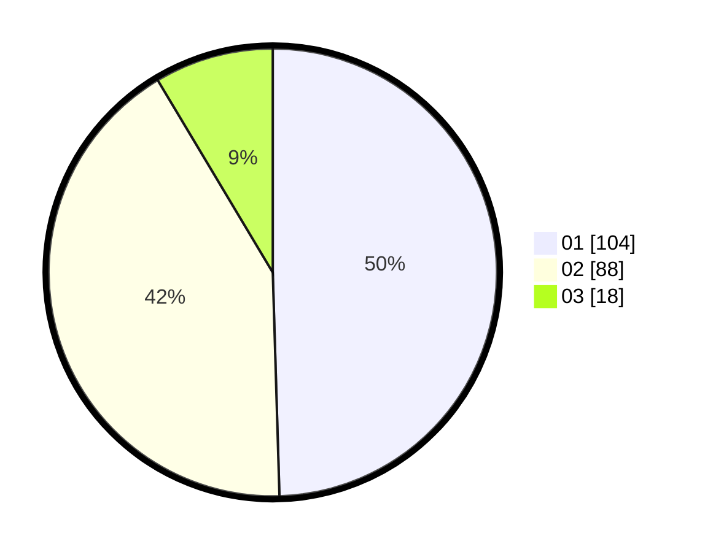

# Hasil

Hasil perolehan suara paslon dapat dilihat pada file paslon-01.txt, paslon-02.txt, dan paslon-03.txt.

Jika tidak ada, artinya data tersebut belum ada pada SIREKAP.

## Perolehan Suara

 * Paslon 01: **104**.
 * Paslon 02: **88**.
 * Paslon 03: **18**.

## Foto C Plano

https://sirekap-obj-formc.kpu.go.id/e40d/pemilu/ppwp/31/71/08/10/04/3171081004079-20240215-150456--2c6ac052-9530-457b-8c21-3503256b0957.jpg

https://sirekap-obj-formc.kpu.go.id/e40d/pemilu/ppwp/31/71/08/10/04/3171081004079-20240215-150522--01186183-7f01-4532-9854-3ca06fac3931.jpg

https://sirekap-obj-formc.kpu.go.id/e40d/pemilu/ppwp/31/71/08/10/04/3171081004079-20240215-150555--bc975e9b-64d3-465b-a1dc-37347cf64716.jpg

## DATA PEMILIH TETAP

Jumlah pemilih dalam DPT: **249**.
 * L: **115**.
 * P: **134**.

## DATA PENGGUNA HAK PILIH

Jumlah pengguna hak pilih dalam DPT: **210**.
 * L: **93**.
 * P: **117**.

Jumlah pengguna hak pilih dalam DPTb: **0**.
 * L: **0**.
 * P: **0**.

Jumlah pengguna hak pilih dalam DPK: **3**.
 * L: **1**.
 * P: **2**.

Jumlah pengguna hak pilih: **213**.
 * L: **94**.
 * P: **119**.

## JUMLAH SUARA SAH DAN TIDAK SAH

JUMLAH SELURUH SUARA SAH: **210**.

JUMLAH SUARA TIDAK SAH: **3**.

JUMLAH SELURUH SUARA SAH DAN SUARA TIDAK SAH: **213**.
