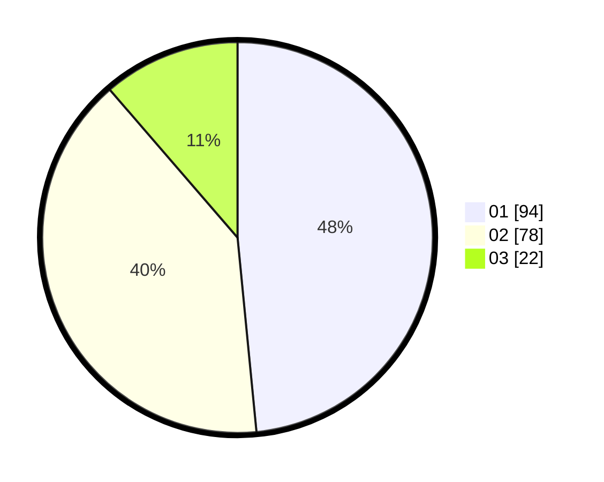

# Hasil

Hasil perolehan suara paslon dapat dilihat pada file paslon-01.txt, paslon-02.txt, dan paslon-03.txt.

Jika tidak ada, artinya data tersebut belum ada pada SIREKAP.

## Perolehan Suara

 * Paslon 01: **94**.
 * Paslon 02: **78**.
 * Paslon 03: **22**.

## Foto C Plano

https://sirekap-obj-formc.kpu.go.id/7fa4/pemilu/ppwp/31/71/08/10/04/3171081004080-20240214-215201--af95d067-c187-4e9b-86e9-aed211372eb7.jpg

https://sirekap-obj-formc.kpu.go.id/7fa4/pemilu/ppwp/31/71/08/10/04/3171081004080-20240214-215244--5d2c30bf-66a2-4678-9c1d-a79059f8e09a.jpg

https://sirekap-obj-formc.kpu.go.id/7fa4/pemilu/ppwp/31/71/08/10/04/3171081004080-20240214-215318--3c0fe964-4dd2-4f4f-a93f-7db5ddceb8b6.jpg
