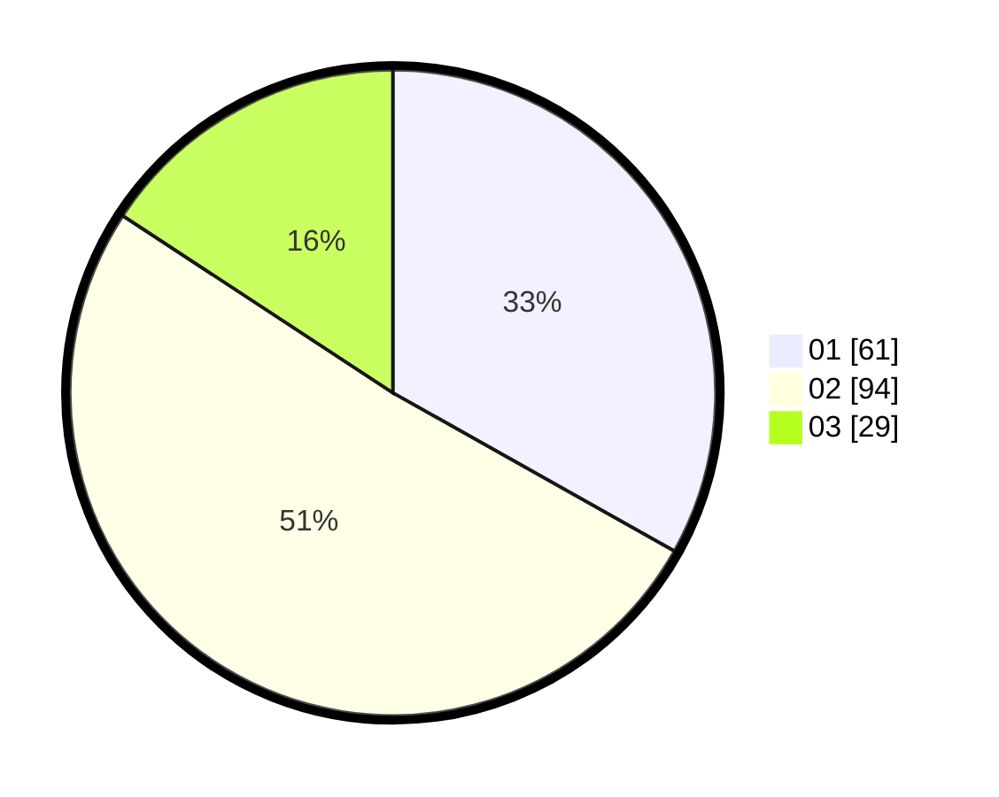

# Hasil

Hasil perolehan suara paslon dapat dilihat pada file paslon-01.txt, paslon-02.txt, dan paslon-03.txt.

Jika tidak ada, artinya data tersebut belum ada pada SIREKAP.

## Perolehan Suara

 * Paslon 01: **61**.
 * Paslon 02: **94**.
 * Paslon 03: **29**.

## Foto C Plano

https://sirekap-obj-formc.kpu.go.id/da0f/pemilu/ppwp/31/71/08/10/04/3171081004086-20240216-144520--afe944c4-1c64-44b2-9b9d-d14315ad4b6f.jpg

https://sirekap-obj-formc.kpu.go.id/da0f/pemilu/ppwp/31/71/08/10/04/3171081004086-20240216-144521--352b2f44-9bb4-4984-94c6-469f9b291f06.jpg

https://sirekap-obj-formc.kpu.go.id/da0f/pemilu/ppwp/31/71/08/10/04/3171081004086-20240216-144520--8d48d7c5-6ab0-477c-9f17-cec2485b1ad5.jpg

## DATA PEMILIH TETAP

Jumlah pemilih dalam DPT: **254**.
 * L: **131**.
 * P: **123**.

## DATA PENGGUNA HAK PILIH

Jumlah pengguna hak pilih dalam DPT: **182**.
 * L: **91**.
 * P: **91**.

Jumlah pengguna hak pilih dalam DPTb: **0**.
 * L: **0**.
 * P: **0**.

Jumlah pengguna hak pilih dalam DPK: **6**.
 * L: **2**.
 * P: **4**.

Jumlah pengguna hak pilih: **188**.
 * L: **93**.
 * P: **95**.

## JUMLAH SUARA SAH DAN TIDAK SAH

JUMLAH SELURUH SUARA SAH: **184**.

JUMLAH SUARA TIDAK SAH: **4**.

JUMLAH SELURUH SUARA SAH DAN SUARA TIDAK SAH: **188**.
