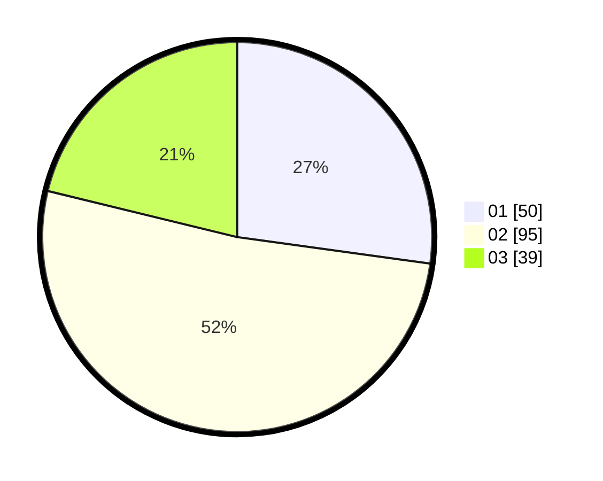

# Hasil

Hasil perolehan suara paslon dapat dilihat pada file paslon-01.txt, paslon-02.txt, dan paslon-03.txt.

Jika tidak ada, artinya data tersebut belum ada pada SIREKAP.

## Perolehan Suara

 * Paslon 01: **50**.
 * Paslon 02: **95**.
 * Paslon 03: **39**.

## Foto C Plano

https://sirekap-obj-formc.kpu.go.id/fe61/pemilu/ppwp/31/71/08/10/04/3171081004087-20240216-111603--56cc23dc-e390-404d-acde-67b92390bbef.jpg

https://sirekap-obj-formc.kpu.go.id/fe61/pemilu/ppwp/31/71/08/10/04/3171081004087-20240216-111626--f4487fcb-2af0-435c-8680-de834bef09ac.jpg

https://sirekap-obj-formc.kpu.go.id/fe61/pemilu/ppwp/31/71/08/10/04/3171081004087-20240216-111649--1831867a-9ad0-479d-b918-70fbd10aa096.jpg
