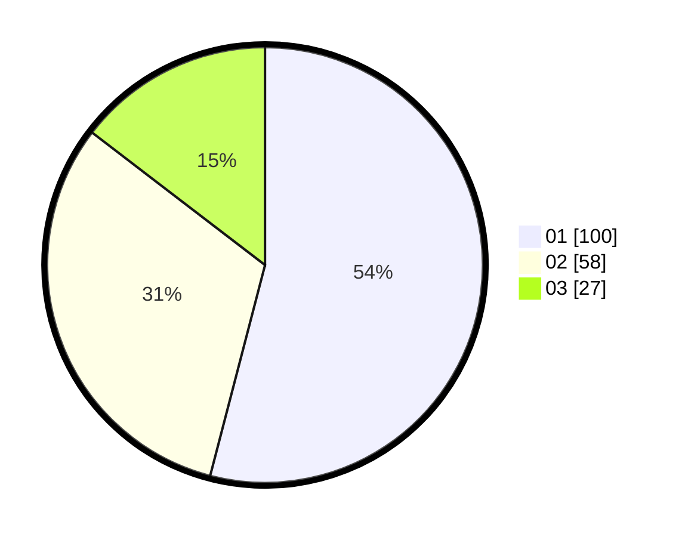

# Hasil

Hasil perolehan suara paslon dapat dilihat pada file paslon-01.txt, paslon-02.txt, dan paslon-03.txt.

Jika tidak ada, artinya data tersebut belum ada pada SIREKAP.

## Perolehan Suara

 * Paslon 01: **100**.
 * Paslon 02: **58**.
 * Paslon 03: **27**.

## Foto C Plano

https://sirekap-obj-formc.kpu.go.id/eb64/pemilu/ppwp/31/71/08/10/04/3171081004088-20240216-080842--d6d69b73-5677-4a66-88b2-dc068f722c54.jpg

https://sirekap-obj-formc.kpu.go.id/eb64/pemilu/ppwp/31/71/08/10/04/3171081004088-20240216-080845--48b19456-5ee4-4336-8e33-a0895e32d253.jpg

https://sirekap-obj-formc.kpu.go.id/eb64/pemilu/ppwp/31/71/08/10/04/3171081004088-20240216-080844--e18b5c8c-0849-4e7c-826b-daa036060949.jpg

## DATA PEMILIH TETAP

Jumlah pemilih dalam DPT: **244**.
 * L: **121**.
 * P: **123**.

## DATA PENGGUNA HAK PILIH

Jumlah pengguna hak pilih dalam DPT: **186**.
 * L: **92**.
 * P: **94**.

Jumlah pengguna hak pilih dalam DPTb: **2**.
 * L: **0**.
 * P: **2**.

Jumlah pengguna hak pilih dalam DPK: **0**.
 * L: **0**.
 * P: **0**.

Jumlah pengguna hak pilih: **188**.
 * L: **92**.
 * P: **96**.

## JUMLAH SUARA SAH DAN TIDAK SAH

JUMLAH SELURUH SUARA SAH: **185**.

JUMLAH SUARA TIDAK SAH: **3**.

JUMLAH SELURUH SUARA SAH DAN SUARA TIDAK SAH: **188**.
