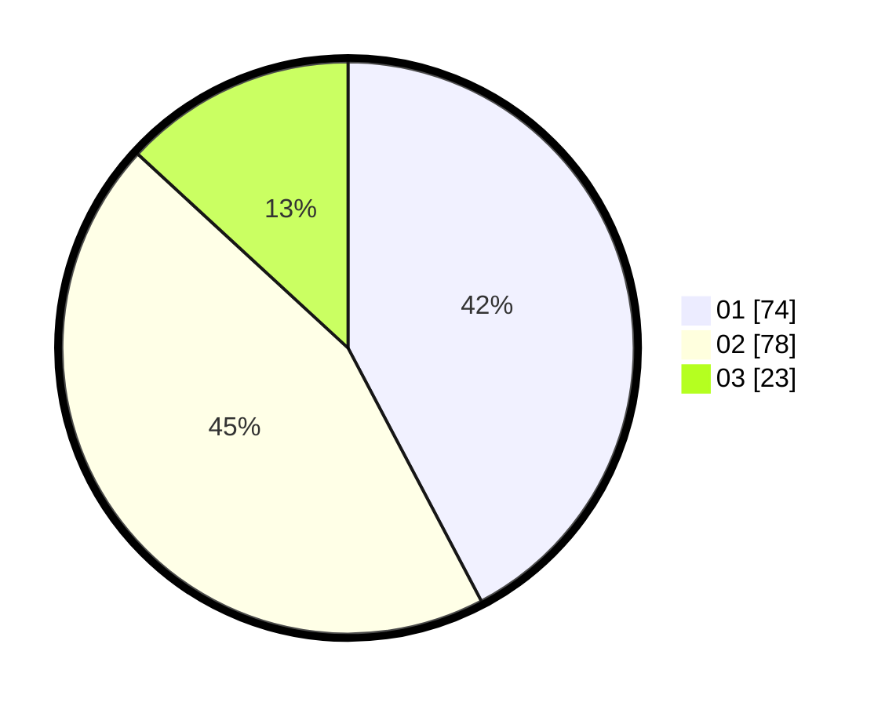

# Hasil

Hasil perolehan suara paslon dapat dilihat pada file paslon-01.txt, paslon-02.txt, dan paslon-03.txt.

Jika tidak ada, artinya data tersebut belum ada pada SIREKAP.

## Perolehan Suara

 * Paslon 01: **74**.
 * Paslon 02: **78**.
 * Paslon 03: **23**.

## Foto C Plano

https://sirekap-obj-formc.kpu.go.id/8e16/pemilu/ppwp/31/71/08/10/04/3171081004095-20240214-190440--fac09a26-1483-4af2-83ec-99724d709cdd.jpg

https://sirekap-obj-formc.kpu.go.id/8e16/pemilu/ppwp/31/71/08/10/04/3171081004095-20240214-200614--d562136f-631b-4bd9-8bf9-add3ae822593.jpg

https://sirekap-obj-formc.kpu.go.id/8e16/pemilu/ppwp/31/71/08/10/04/3171081004095-20240214-192325--bc52441d-f978-4d11-a945-b93e7b167d01.jpg

## DATA PEMILIH TETAP

Jumlah pemilih dalam DPT: **246**.
 * L: **118**.
 * P: **128**.

## DATA PENGGUNA HAK PILIH

Jumlah pengguna hak pilih dalam DPT: **157**.
 * L: **71**.
 * P: **86**.

Jumlah pengguna hak pilih dalam DPTb: **11**.
 * L: **4**.
 * P: **7**.

Jumlah pengguna hak pilih dalam DPK: **0**.
 * L: **0**.
 * P: **0**.

Jumlah pengguna hak pilih: **168**.
 * L: **75**.
 * P: **93**.

## JUMLAH SUARA SAH DAN TIDAK SAH

JUMLAH SELURUH SUARA SAH: **175**.

JUMLAH SUARA TIDAK SAH: **6**.

JUMLAH SELURUH SUARA SAH DAN SUARA TIDAK SAH: **181**.
