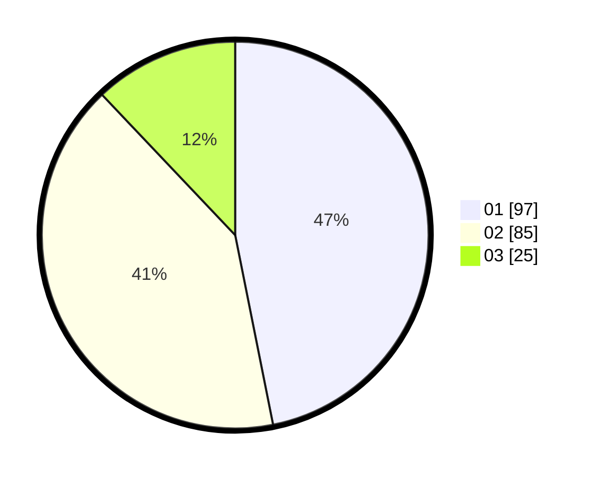

# Hasil

Hasil perolehan suara paslon dapat dilihat pada file paslon-01.txt, paslon-02.txt, dan paslon-03.txt.

Jika tidak ada, artinya data tersebut belum ada pada SIREKAP.

## Perolehan Suara

 * Paslon 01: **97**.
 * Paslon 02: **85**.
 * Paslon 03: **25**.

## Foto C Plano

https://sirekap-obj-formc.kpu.go.id/379a/pemilu/ppwp/31/71/08/10/04/3171081004096-20240214-191305--3fffd145-9705-40e7-a2df-8b21f223f00d.jpg

https://sirekap-obj-formc.kpu.go.id/379a/pemilu/ppwp/31/71/08/10/04/3171081004096-20240214-191615--3e23ff30-9b3b-4be2-a6e2-e3381e1cc5fd.jpg

https://sirekap-obj-formc.kpu.go.id/379a/pemilu/ppwp/31/71/08/10/04/3171081004096-20240214-192123--d16712f0-9ab4-495e-9830-1771af03eb6f.jpg

## DATA PEMILIH TETAP

Jumlah pemilih dalam DPT: **253**.
 * L: **124**.
 * P: **129**.

## DATA PENGGUNA HAK PILIH

Jumlah pengguna hak pilih dalam DPT: **205**.
 * L: **99**.
 * P: **106**.

Jumlah pengguna hak pilih dalam DPTb: **3**.
 * L: **1**.
 * P: **2**.

Jumlah pengguna hak pilih dalam DPK: **0**.
 * L: **0**.
 * P: **0**.

Jumlah pengguna hak pilih: **208**.
 * L: **100**.
 * P: **108**.

## JUMLAH SUARA SAH DAN TIDAK SAH

JUMLAH SELURUH SUARA SAH: **207**.

JUMLAH SUARA TIDAK SAH: **1**.

JUMLAH SELURUH SUARA SAH DAN SUARA TIDAK SAH: **208**.
