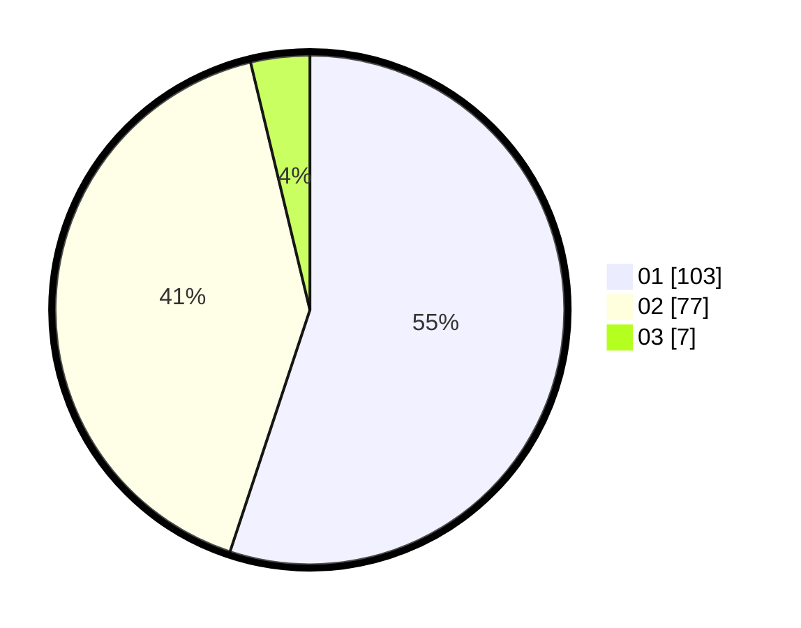

# Hasil

Hasil perolehan suara paslon dapat dilihat pada file paslon-01.txt, paslon-02.txt, dan paslon-03.txt.

Jika tidak ada, artinya data tersebut belum ada pada SIREKAP.

## Perolehan Suara

 * Paslon 01: **103**.
 * Paslon 02: **77**.
 * Paslon 03: **7**.

## Foto C Plano

https://sirekap-obj-formc.kpu.go.id/ace7/pemilu/ppwp/31/71/08/10/04/3171081004097-20240214-155112--c623cce6-cdc0-4549-8202-e7a7e8ce46d4.jpg

https://sirekap-obj-formc.kpu.go.id/ace7/pemilu/ppwp/31/71/08/10/04/3171081004097-20240214-155116--424194e6-5686-46f3-a0fa-80ac75310357.jpg

https://sirekap-obj-formc.kpu.go.id/ace7/pemilu/ppwp/31/71/08/10/04/3171081004097-20240214-155121--dfdd1a3e-8004-4c3b-a987-4cbe1a42cdc5.jpg

## DATA PEMILIH TETAP

Jumlah pemilih dalam DPT: **244**.
 * L: **128**.
 * P: **116**.

## DATA PENGGUNA HAK PILIH

Jumlah pengguna hak pilih dalam DPT: **184**.
 * L: **93**.
 * P: **91**.

Jumlah pengguna hak pilih dalam DPTb: **5**.
 * L: **1**.
 * P: **4**.

Jumlah pengguna hak pilih dalam DPK: **3**.
 * L: **2**.
 * P: **1**.

Jumlah pengguna hak pilih: **192**.
 * L: **96**.
 * P: **96**.

## JUMLAH SUARA SAH DAN TIDAK SAH

JUMLAH SELURUH SUARA SAH: **187**.

JUMLAH SUARA TIDAK SAH: **5**.

JUMLAH SELURUH SUARA SAH DAN SUARA TIDAK SAH: **192**.
