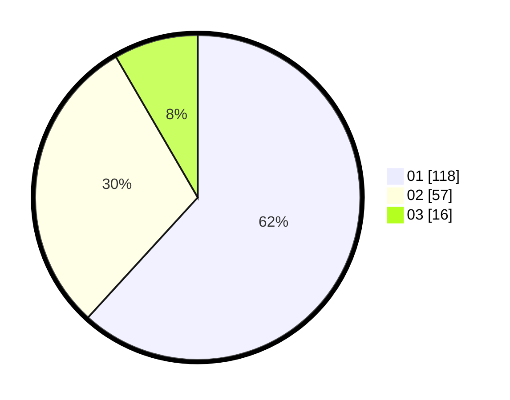

# Hasil

Hasil perolehan suara paslon dapat dilihat pada file paslon-01.txt, paslon-02.txt, dan paslon-03.txt.

Jika tidak ada, artinya data tersebut belum ada pada SIREKAP.

## Perolehan Suara

 * Paslon 01: **118**.
 * Paslon 02: **57**.
 * Paslon 03: **16**.

## Foto C Plano

https://sirekap-obj-formc.kpu.go.id/a556/pemilu/ppwp/31/71/08/10/04/3171081004098-20240217-202659--19858219-9493-4bab-9034-e063ce6630f5.jpg

https://sirekap-obj-formc.kpu.go.id/a556/pemilu/ppwp/31/71/08/10/04/3171081004098-20240217-202701--28e2ecf8-1653-4701-a2b6-3dbf19d1fa36.jpg

https://sirekap-obj-formc.kpu.go.id/a556/pemilu/ppwp/31/71/08/10/04/3171081004098-20240217-202700--12ee7ce3-b931-4f05-a32f-89535aaaf3ca.jpg

## DATA PEMILIH TETAP

Jumlah pemilih dalam DPT: **247**.
 * L: **118**.
 * P: **129**.

## DATA PENGGUNA HAK PILIH

Jumlah pengguna hak pilih dalam DPT: **181**.
 * L: **80**.
 * P: **101**.

Jumlah pengguna hak pilih dalam DPTb: **8**.
 * L: **4**.
 * P: **4**.

Jumlah pengguna hak pilih dalam DPK: **2**.
 * L: **1**.
 * P: **1**.

Jumlah pengguna hak pilih: **191**.
 * L: **85**.
 * P: **106**.

## JUMLAH SUARA SAH DAN TIDAK SAH

JUMLAH SELURUH SUARA SAH: **191**.

JUMLAH SUARA TIDAK SAH: **0**.

JUMLAH SELURUH SUARA SAH DAN SUARA TIDAK SAH: **191**.
