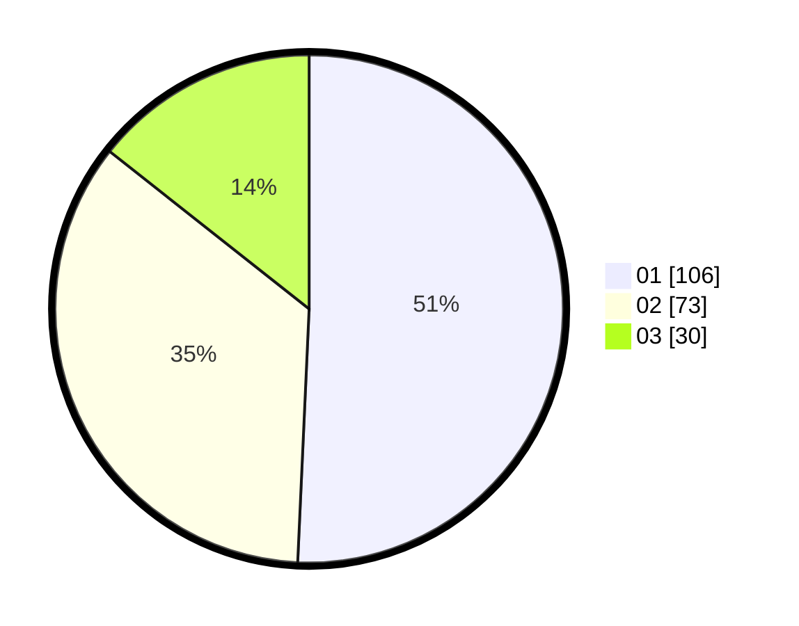

# Hasil

Hasil perolehan suara paslon dapat dilihat pada file paslon-01.txt, paslon-02.txt, dan paslon-03.txt.

Jika tidak ada, artinya data tersebut belum ada pada SIREKAP.

## Perolehan Suara

 * Paslon 01: **106**.
 * Paslon 02: **73**.
 * Paslon 03: **30**.

## Foto C Plano

https://sirekap-obj-formc.kpu.go.id/caab/pemilu/ppwp/31/71/08/10/04/3171081004100-20240214-223034--358f0243-e242-437f-946d-508c145c4c7d.jpg

https://sirekap-obj-formc.kpu.go.id/caab/pemilu/ppwp/31/71/08/10/04/3171081004100-20240214-223723--68c756a9-7c25-4df3-9f8d-b82f44c2a783.jpg

https://sirekap-obj-formc.kpu.go.id/caab/pemilu/ppwp/31/71/08/10/04/3171081004100-20240214-224329--5e150dde-197d-47ec-9beb-a8fa89f5cdf8.jpg
