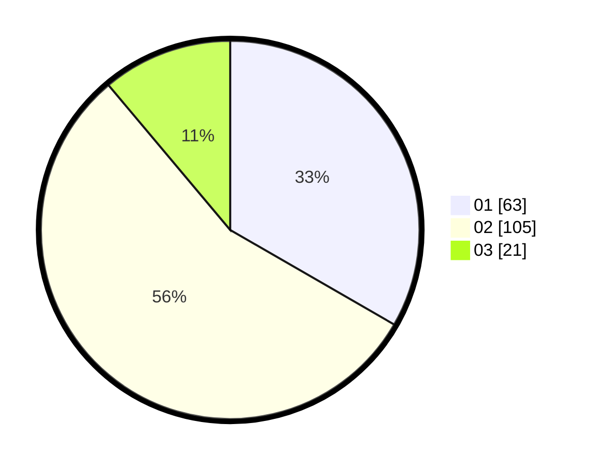

# Hasil

Hasil perolehan suara paslon dapat dilihat pada file paslon-01.txt, paslon-02.txt, dan paslon-03.txt.

Jika tidak ada, artinya data tersebut belum ada pada SIREKAP.

## Perolehan Suara

 * Paslon 01: **63**.
 * Paslon 02: **105**.
 * Paslon 03: **21**.

## Foto C Plano

https://sirekap-obj-formc.kpu.go.id/c298/pemilu/ppwp/31/71/08/10/04/3171081004104-20240215-015254--eaafb88c-5702-468c-8bf7-1e812b22474d.jpg

https://sirekap-obj-formc.kpu.go.id/c298/pemilu/ppwp/31/71/08/10/04/3171081004104-20240215-015507--23daf9df-240d-4b57-ba78-c44721f2f306.jpg

https://sirekap-obj-formc.kpu.go.id/c298/pemilu/ppwp/31/71/08/10/04/3171081004104-20240215-015749--548db182-b796-4675-aa2e-381f5dde5858.jpg

## DATA PEMILIH TETAP

Jumlah pemilih dalam DPT: **245**.
 * L: **131**.
 * P: **114**.

## DATA PENGGUNA HAK PILIH

Jumlah pengguna hak pilih dalam DPT: **193**.
 * L: **104**.
 * P: **89**.

Jumlah pengguna hak pilih dalam DPTb: **0**.
 * L: **0**.
 * P: **0**.

Jumlah pengguna hak pilih dalam DPK: **1**.
 * L: **0**.
 * P: **1**.

Jumlah pengguna hak pilih: **194**.
 * L: **104**.
 * P: **90**.

## JUMLAH SUARA SAH DAN TIDAK SAH

JUMLAH SELURUH SUARA SAH: **189**.

JUMLAH SUARA TIDAK SAH: **5**.

JUMLAH SELURUH SUARA SAH DAN SUARA TIDAK SAH: **194**.
