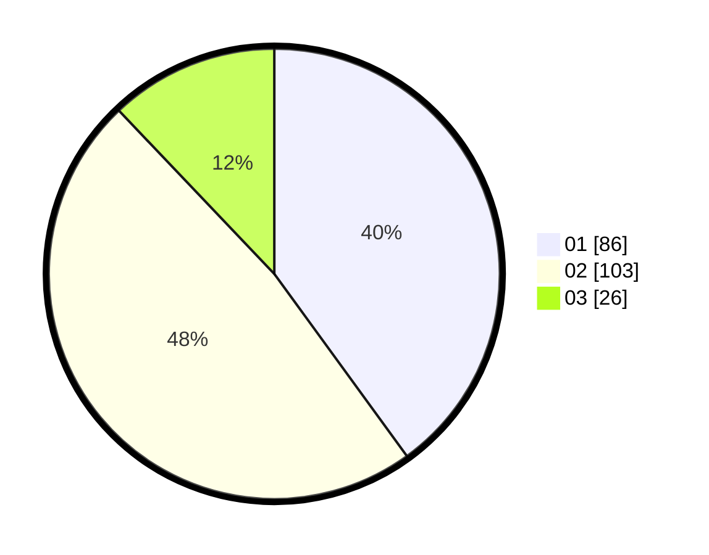

# Hasil

Hasil perolehan suara paslon dapat dilihat pada file paslon-01.txt, paslon-02.txt, dan paslon-03.txt.

Jika tidak ada, artinya data tersebut belum ada pada SIREKAP.

## Perolehan Suara

 * Paslon 01: **86**.
 * Paslon 02: **103**.
 * Paslon 03: **26**.

## Foto C Plano

https://sirekap-obj-formc.kpu.go.id/8519/pemilu/ppwp/31/71/08/10/04/3171081004108-20240217-225107--b1511e5c-1381-42be-b9fb-ac2fd8039d91.jpg

https://sirekap-obj-formc.kpu.go.id/8519/pemilu/ppwp/31/71/08/10/04/3171081004108-20240217-225109--699d7627-ad94-4884-a92b-ece3009434a2.jpg

https://sirekap-obj-formc.kpu.go.id/8519/pemilu/ppwp/31/71/08/10/04/3171081004108-20240217-225108--f8421c65-e179-423e-bd2c-47071bd38dcb.jpg

## DATA PEMILIH TETAP

Jumlah pemilih dalam DPT: **260**.
 * L: **126**.
 * P: **134**.

## DATA PENGGUNA HAK PILIH

Jumlah pengguna hak pilih dalam DPT: **211**.
 * L: **99**.
 * P: **112**.

Jumlah pengguna hak pilih dalam DPTb: **1**.
 * L: **0**.
 * P: **1**.

Jumlah pengguna hak pilih dalam DPK: **6**.
 * L: **3**.
 * P: **3**.

Jumlah pengguna hak pilih: **218**.
 * L: **102**.
 * P: **116**.

## JUMLAH SUARA SAH DAN TIDAK SAH

JUMLAH SELURUH SUARA SAH: **215**.

JUMLAH SUARA TIDAK SAH: **3**.

JUMLAH SELURUH SUARA SAH DAN SUARA TIDAK SAH: **218**.
