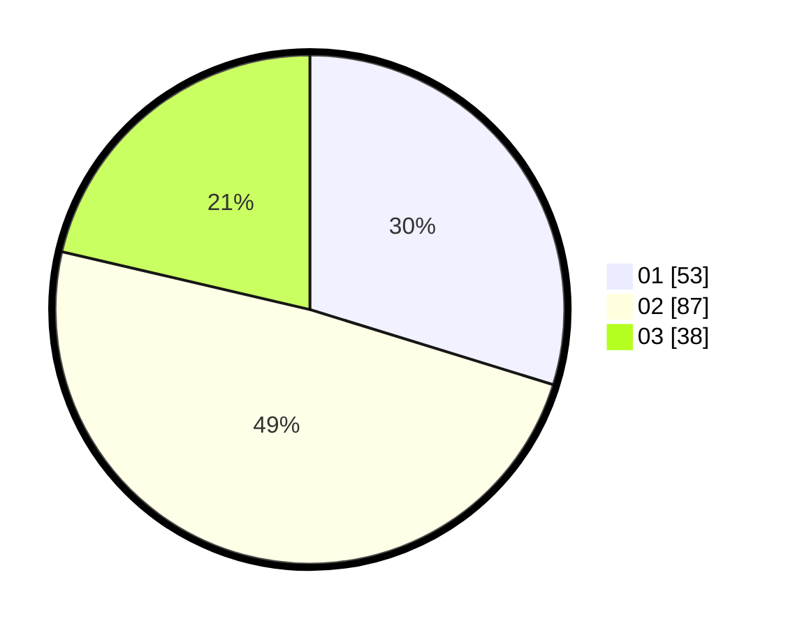

# Hasil

Hasil perolehan suara paslon dapat dilihat pada file paslon-01.txt, paslon-02.txt, dan paslon-03.txt.

Jika tidak ada, artinya data tersebut belum ada pada SIREKAP.

## Perolehan Suara

 * Paslon 01: **53**.
 * Paslon 02: **87**.
 * Paslon 03: **38**.

## Foto C Plano

https://sirekap-obj-formc.kpu.go.id/a2a8/pemilu/ppwp/31/71/08/10/04/3171081004112-20240216-145703--73e9c726-cf49-4a96-947b-bbdd84d54c75.jpg

https://sirekap-obj-formc.kpu.go.id/a2a8/pemilu/ppwp/31/71/08/10/04/3171081004112-20240216-145704--8cb839c1-07d2-4ca6-aeeb-29357274869f.jpg

https://sirekap-obj-formc.kpu.go.id/a2a8/pemilu/ppwp/31/71/08/10/04/3171081004112-20240216-145704--2ba0683a-56ad-4310-8be4-76f066c2d933.jpg

## DATA PEMILIH TETAP

Jumlah pemilih dalam DPT: **267**.
 * L: **144**.
 * P: **123**.

## DATA PENGGUNA HAK PILIH

Jumlah pengguna hak pilih dalam DPT: **182**.
 * L: **96**.
 * P: **86**.

Jumlah pengguna hak pilih dalam DPTb: **0**.
 * L: **0**.
 * P: **0**.

Jumlah pengguna hak pilih dalam DPK: **0**.
 * L: **0**.
 * P: **0**.

Jumlah pengguna hak pilih: **182**.
 * L: **96**.
 * P: **86**.

## JUMLAH SUARA SAH DAN TIDAK SAH

JUMLAH SELURUH SUARA SAH: **178**.

JUMLAH SUARA TIDAK SAH: **4**.

JUMLAH SELURUH SUARA SAH DAN SUARA TIDAK SAH: **182**.
