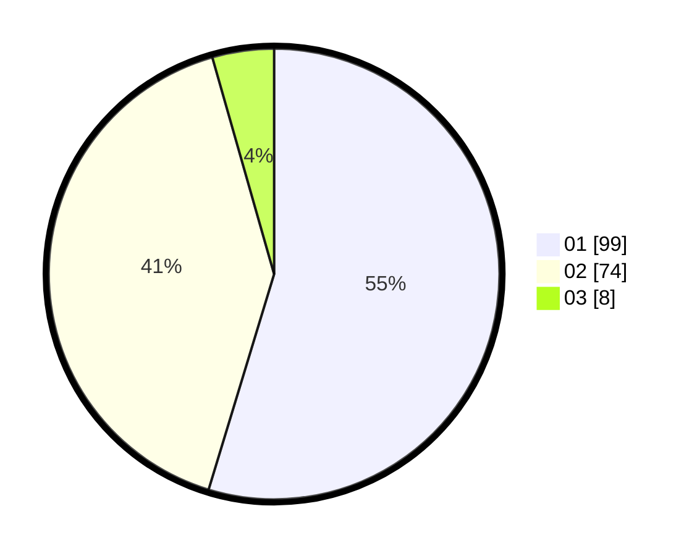

# Hasil

Hasil perolehan suara paslon dapat dilihat pada file paslon-01.txt, paslon-02.txt, dan paslon-03.txt.

Jika tidak ada, artinya data tersebut belum ada pada SIREKAP.

## Perolehan Suara

 * Paslon 01: **99**.
 * Paslon 02: **74**.
 * Paslon 03: **8**.

## Foto C Plano

https://sirekap-obj-formc.kpu.go.id/b42a/pemilu/ppwp/31/71/08/10/04/3171081004114-20240216-174319--f0e17e2a-01e0-4df8-859f-ee82ead53ac0.jpg

https://sirekap-obj-formc.kpu.go.id/b42a/pemilu/ppwp/31/71/08/10/04/3171081004114-20240216-174320--018ba8c7-f6f8-4818-9599-659aeb5b2a34.jpg

https://sirekap-obj-formc.kpu.go.id/b42a/pemilu/ppwp/31/71/08/10/04/3171081004114-20240216-174320--ee78ed6b-ac9f-43cf-9c20-1a6b7aaf8b5c.jpg

## DATA PEMILIH TETAP

Jumlah pemilih dalam DPT: **264**.
 * L: **138**.
 * P: **126**.

## DATA PENGGUNA HAK PILIH

Jumlah pengguna hak pilih dalam DPT: **183**.
 * L: **92**.
 * P: **91**.

Jumlah pengguna hak pilih dalam DPTb: **0**.
 * L: **0**.
 * P: **0**.

Jumlah pengguna hak pilih dalam DPK: **0**.
 * L: **0**.
 * P: **0**.

Jumlah pengguna hak pilih: **183**.
 * L: **92**.
 * P: **91**.

## JUMLAH SUARA SAH DAN TIDAK SAH

JUMLAH SELURUH SUARA SAH: **181**.

JUMLAH SUARA TIDAK SAH: **2**.

JUMLAH SELURUH SUARA SAH DAN SUARA TIDAK SAH: **183**.
