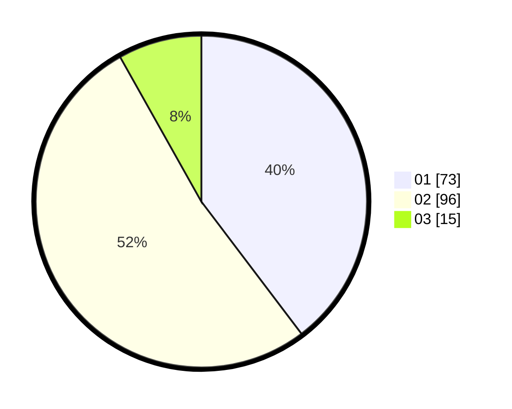

# Hasil

Hasil perolehan suara paslon dapat dilihat pada file paslon-01.txt, paslon-02.txt, dan paslon-03.txt.

Jika tidak ada, artinya data tersebut belum ada pada SIREKAP.

## Perolehan Suara

 * Paslon 01: **73**.
 * Paslon 02: **96**.
 * Paslon 03: **15**.

## Foto C Plano

https://sirekap-obj-formc.kpu.go.id/7289/pemilu/ppwp/31/71/08/10/04/3171081004116-20240216-131845--aae43158-2867-4ae5-8b51-70ec79ce0364.jpg

https://sirekap-obj-formc.kpu.go.id/7289/pemilu/ppwp/31/71/08/10/04/3171081004116-20240216-131846--468fefd4-0de6-4e94-afcb-1ccdc0c4545a.jpg

https://sirekap-obj-formc.kpu.go.id/7289/pemilu/ppwp/31/71/08/10/04/3171081004116-20240216-131846--a48bf1df-b59a-48ab-b5fa-eb2979b304ed.jpg

## DATA PEMILIH TETAP

Jumlah pemilih dalam DPT: **256**.
 * L: **136**.
 * P: **120**.

## DATA PENGGUNA HAK PILIH

Jumlah pengguna hak pilih dalam DPT: **189**.
 * L: **93**.
 * P: **96**.

Jumlah pengguna hak pilih dalam DPTb: **0**.
 * L: **0**.
 * P: **0**.

Jumlah pengguna hak pilih dalam DPK: **0**.
 * L: **0**.
 * P: **0**.

Jumlah pengguna hak pilih: **189**.
 * L: **93**.
 * P: **96**.

## JUMLAH SUARA SAH DAN TIDAK SAH

JUMLAH SELURUH SUARA SAH: **184**.

JUMLAH SUARA TIDAK SAH: **5**.

JUMLAH SELURUH SUARA SAH DAN SUARA TIDAK SAH: **189**.
