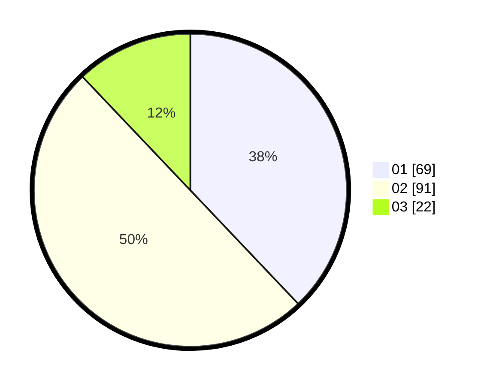

# Hasil

Hasil perolehan suara paslon dapat dilihat pada file paslon-01.txt, paslon-02.txt, dan paslon-03.txt.

Jika tidak ada, artinya data tersebut belum ada pada SIREKAP.

## Perolehan Suara

 * Paslon 01: **69**.
 * Paslon 02: **91**.
 * Paslon 03: **22**.

## Foto C Plano

https://sirekap-obj-formc.kpu.go.id/0cc0/pemilu/ppwp/31/71/08/10/04/3171081004119-20240216-150441--f1f7c920-8639-408a-b632-d0e49cbcc7c8.jpg

https://sirekap-obj-formc.kpu.go.id/0cc0/pemilu/ppwp/31/71/08/10/04/3171081004119-20240216-150442--58716909-e507-4b0f-a14a-ef295898e747.jpg

https://sirekap-obj-formc.kpu.go.id/0cc0/pemilu/ppwp/31/71/08/10/04/3171081004119-20240216-150441--7137d7c2-c311-4dc2-bb1e-5273ad298e07.jpg

## DATA PEMILIH TETAP

Jumlah pemilih dalam DPT: **249**.
 * L: **126**.
 * P: **123**.

## DATA PENGGUNA HAK PILIH

Jumlah pengguna hak pilih dalam DPT: **188**.
 * L: **91**.
 * P: **97**.

Jumlah pengguna hak pilih dalam DPTb: **0**.
 * L: **0**.
 * P: **0**.

Jumlah pengguna hak pilih dalam DPK: **0**.
 * L: **0**.
 * P: **0**.

Jumlah pengguna hak pilih: **188**.
 * L: **91**.
 * P: **97**.

## JUMLAH SUARA SAH DAN TIDAK SAH

JUMLAH SELURUH SUARA SAH: **182**.

JUMLAH SUARA TIDAK SAH: **6**.

JUMLAH SELURUH SUARA SAH DAN SUARA TIDAK SAH: **188**.
