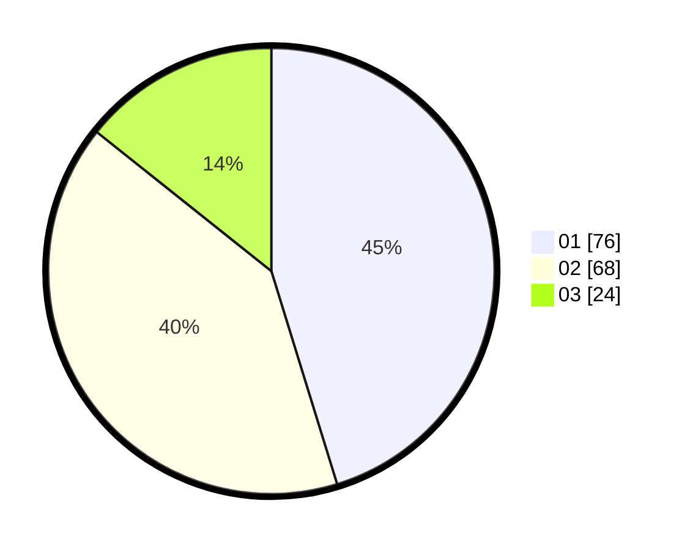

# Hasil

Hasil perolehan suara paslon dapat dilihat pada file paslon-01.txt, paslon-02.txt, dan paslon-03.txt.

Jika tidak ada, artinya data tersebut belum ada pada SIREKAP.

## Perolehan Suara

 * Paslon 01: **76**.
 * Paslon 02: **68**.
 * Paslon 03: **24**.

## Foto C Plano

https://sirekap-obj-formc.kpu.go.id/4224/pemilu/ppwp/31/71/08/10/04/3171081004120-20240214-190355--949c1747-fbd2-467c-9084-48c4e3375de6.jpg

https://sirekap-obj-formc.kpu.go.id/4224/pemilu/ppwp/31/71/08/10/04/3171081004120-20240214-192118--84d3c11c-3678-449d-b894-6190c181af61.jpg

https://sirekap-obj-formc.kpu.go.id/4224/pemilu/ppwp/31/71/08/10/04/3171081004120-20240214-192439--6e4cbb6d-7120-446d-ae3a-4778f4dec584.jpg
