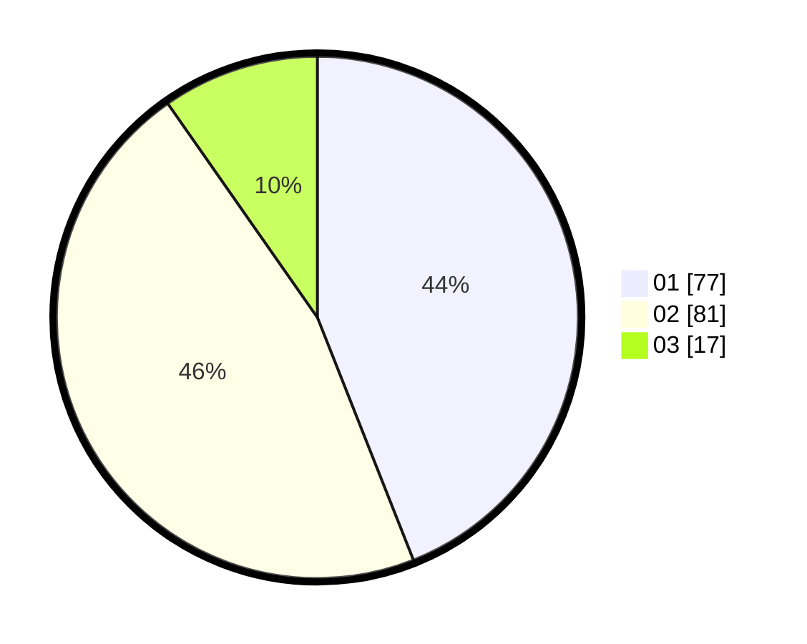

# Hasil

Hasil perolehan suara paslon dapat dilihat pada file paslon-01.txt, paslon-02.txt, dan paslon-03.txt.

Jika tidak ada, artinya data tersebut belum ada pada SIREKAP.

## Perolehan Suara

 * Paslon 01: **77**.
 * Paslon 02: **81**.
 * Paslon 03: **17**.

## Foto C Plano

https://sirekap-obj-formc.kpu.go.id/080f/pemilu/ppwp/31/71/08/10/04/3171081004122-20240216-043425--ac92360a-1af3-4feb-aaf1-7d7c8469bebd.jpg

https://sirekap-obj-formc.kpu.go.id/080f/pemilu/ppwp/31/71/08/10/04/3171081004122-20240216-061848--d5ea1053-4322-45ef-8420-61c72ad30297.jpg

https://sirekap-obj-formc.kpu.go.id/080f/pemilu/ppwp/31/71/08/10/04/3171081004122-20240216-050200--6c631133-7c80-43fc-9781-6e22cb23e75b.jpg

## DATA PEMILIH TETAP

Jumlah pemilih dalam DPT: **244**.
 * L: **122**.
 * P: **122**.

## DATA PENGGUNA HAK PILIH

Jumlah pengguna hak pilih dalam DPT: **174**.
 * L: **85**.
 * P: **89**.

Jumlah pengguna hak pilih dalam DPTb: **4**.
 * L: **1**.
 * P: **3**.

Jumlah pengguna hak pilih dalam DPK: **0**.
 * L: **0**.
 * P: **0**.

Jumlah pengguna hak pilih: **178**.
 * L: **86**.
 * P: **92**.

## JUMLAH SUARA SAH DAN TIDAK SAH

JUMLAH SELURUH SUARA SAH: **175**.

JUMLAH SUARA TIDAK SAH: **3**.

JUMLAH SELURUH SUARA SAH DAN SUARA TIDAK SAH: **178**.
