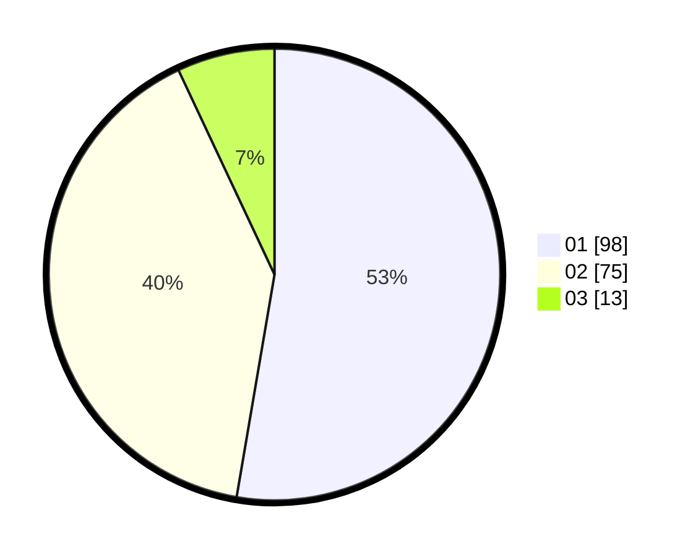

# Hasil

Hasil perolehan suara paslon dapat dilihat pada file paslon-01.txt, paslon-02.txt, dan paslon-03.txt.

Jika tidak ada, artinya data tersebut belum ada pada SIREKAP.

## Perolehan Suara

 * Paslon 01: **98**.
 * Paslon 02: **75**.
 * Paslon 03: **13**.

## Foto C Plano

https://sirekap-obj-formc.kpu.go.id/e62b/pemilu/ppwp/31/71/08/10/04/3171081004123-20240214-155340--f4187073-79e6-4572-b7b4-9129ae62461e.jpg

https://sirekap-obj-formc.kpu.go.id/e62b/pemilu/ppwp/31/71/08/10/04/3171081004123-20240214-155124--677342bb-8545-4866-ab34-fa4a3c2562cd.jpg

https://sirekap-obj-formc.kpu.go.id/e62b/pemilu/ppwp/31/71/08/10/04/3171081004123-20240214-155158--e7b19913-d6e4-4bdf-8707-eab7dc2ecbf3.jpg

## DATA PEMILIH TETAP

Jumlah pemilih dalam DPT: **246**.
 * L: **129**.
 * P: **117**.

## DATA PENGGUNA HAK PILIH

Jumlah pengguna hak pilih dalam DPT: **187**.
 * L: **94**.
 * P: **93**.

Jumlah pengguna hak pilih dalam DPTb: **2**.
 * L: **1**.
 * P: **1**.

Jumlah pengguna hak pilih dalam DPK: **0**.
 * L: **0**.
 * P: **0**.

Jumlah pengguna hak pilih: **189**.
 * L: **95**.
 * P: **94**.

## JUMLAH SUARA SAH DAN TIDAK SAH

JUMLAH SELURUH SUARA SAH: **186**.

JUMLAH SUARA TIDAK SAH: **3**.

JUMLAH SELURUH SUARA SAH DAN SUARA TIDAK SAH: **189**.
