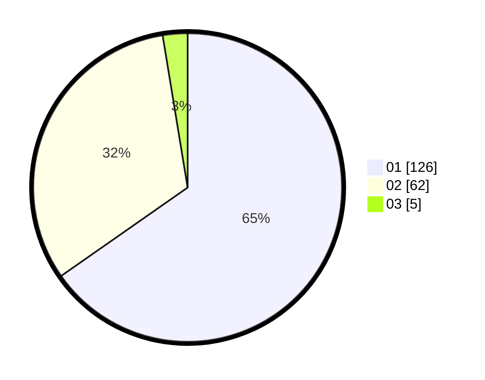

# Hasil

Hasil perolehan suara paslon dapat dilihat pada file paslon-01.txt, paslon-02.txt, dan paslon-03.txt.

Jika tidak ada, artinya data tersebut belum ada pada SIREKAP.

## Perolehan Suara

 * Paslon 01: **126**.
 * Paslon 02: **62**.
 * Paslon 03: **5**.

## Foto C Plano

https://sirekap-obj-formc.kpu.go.id/56a7/pemilu/ppwp/31/71/08/10/04/3171081004124-20240214-205112--9d9ae42c-2306-4118-bfb8-8ccb9c6351a0.jpg

https://sirekap-obj-formc.kpu.go.id/56a7/pemilu/ppwp/31/71/08/10/04/3171081004124-20240214-205316--7b90c4c4-beee-4091-9ae3-5642cbbcf537.jpg

https://sirekap-obj-formc.kpu.go.id/56a7/pemilu/ppwp/31/71/08/10/04/3171081004124-20240215-004955--3d480517-63fc-4fc0-99ab-932d0c867b11.jpg
