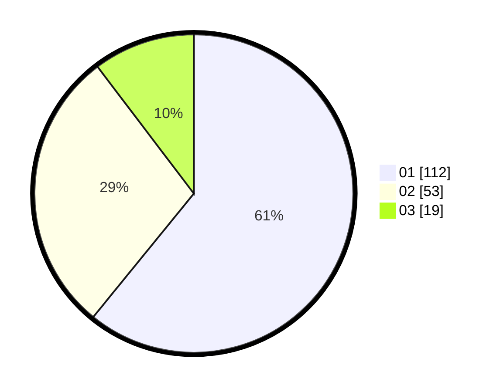

# Hasil

Hasil perolehan suara paslon dapat dilihat pada file paslon-01.txt, paslon-02.txt, dan paslon-03.txt.

Jika tidak ada, artinya data tersebut belum ada pada SIREKAP.

## Perolehan Suara

 * Paslon 01: **112**.
 * Paslon 02: **53**.
 * Paslon 03: **19**.

## Foto C Plano

https://sirekap-obj-formc.kpu.go.id/b475/pemilu/ppwp/31/71/08/10/04/3171081004126-20240215-124031--f8a13564-9d11-495a-8a5e-15b43b9d9913.jpg

https://sirekap-obj-formc.kpu.go.id/b475/pemilu/ppwp/31/71/08/10/04/3171081004126-20240214-222248--c2dc840d-e145-4a86-97b2-1079805d1819.jpg

https://sirekap-obj-formc.kpu.go.id/b475/pemilu/ppwp/31/71/08/10/04/3171081004126-20240214-222059--accb66cd-8902-475a-816b-73ffe0c51f16.jpg

## DATA PEMILIH TETAP

Jumlah pemilih dalam DPT: **264**.
 * L: **120**.
 * P: **144**.

## DATA PENGGUNA HAK PILIH

Jumlah pengguna hak pilih dalam DPT: **187**.
 * L: **87**.
 * P: **100**.

Jumlah pengguna hak pilih dalam DPTb: **1**.
 * L: **1**.
 * P: **0**.

Jumlah pengguna hak pilih dalam DPK: **0**.
 * L: **0**.
 * P: **0**.

Jumlah pengguna hak pilih: **188**.
 * L: **88**.
 * P: **100**.

## JUMLAH SUARA SAH DAN TIDAK SAH

JUMLAH SELURUH SUARA SAH: **184**.

JUMLAH SUARA TIDAK SAH: **4**.

JUMLAH SELURUH SUARA SAH DAN SUARA TIDAK SAH: **188**.
