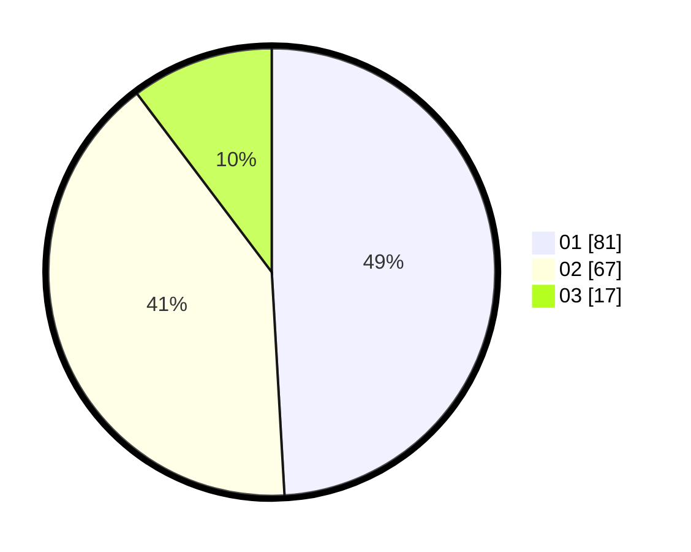

# Hasil

Hasil perolehan suara paslon dapat dilihat pada file paslon-01.txt, paslon-02.txt, dan paslon-03.txt.

Jika tidak ada, artinya data tersebut belum ada pada SIREKAP.

## Perolehan Suara

 * Paslon 01: **81**.
 * Paslon 02: **67**.
 * Paslon 03: **17**.

## Foto C Plano

https://sirekap-obj-formc.kpu.go.id/82de/pemilu/ppwp/31/71/08/10/04/3171081004128-20240215-014209--d16aa48e-5067-44e0-8abc-ebe599c2a5a9.jpg

https://sirekap-obj-formc.kpu.go.id/82de/pemilu/ppwp/31/71/08/10/04/3171081004128-20240215-014611--6b61db1a-00fa-4a14-b504-74b09a582083.jpg

https://sirekap-obj-formc.kpu.go.id/82de/pemilu/ppwp/31/71/08/10/04/3171081004128-20240214-225739--e44078be-6b91-499f-bfc8-c4e7c9b2dc77.jpg
