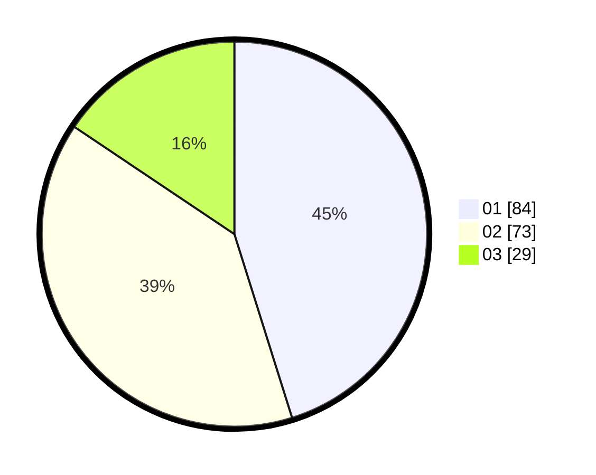

# Hasil

Hasil perolehan suara paslon dapat dilihat pada file paslon-01.txt, paslon-02.txt, dan paslon-03.txt.

Jika tidak ada, artinya data tersebut belum ada pada SIREKAP.

## Perolehan Suara

 * Paslon 01: **84**.
 * Paslon 02: **73**.
 * Paslon 03: **29**.

## Foto C Plano

https://sirekap-obj-formc.kpu.go.id/0508/pemilu/ppwp/31/71/08/10/04/3171081004129-20240216-045145--f55bbc8b-65f0-41be-b2ad-cf49950df170.jpg

https://sirekap-obj-formc.kpu.go.id/0508/pemilu/ppwp/31/71/08/10/04/3171081004129-20240216-045149--173e2ce8-45ea-41d3-9f96-6f1f900df553.jpg

https://sirekap-obj-formc.kpu.go.id/0508/pemilu/ppwp/31/71/08/10/04/3171081004129-20240214-203927--28bb4118-9793-4f2a-8778-81fd7aea85ae.jpg

## DATA PEMILIH TETAP

Jumlah pemilih dalam DPT: **261**.
 * L: **140**.
 * P: **121**.

## DATA PENGGUNA HAK PILIH

Jumlah pengguna hak pilih dalam DPT: **186**.
 * L: **93**.
 * P: **93**.

Jumlah pengguna hak pilih dalam DPTb: **0**.
 * L: **0**.
 * P: **0**.

Jumlah pengguna hak pilih dalam DPK: **2**.
 * L: **2**.
 * P: **0**.

Jumlah pengguna hak pilih: **188**.
 * L: **95**.
 * P: **93**.

## JUMLAH SUARA SAH DAN TIDAK SAH

JUMLAH SELURUH SUARA SAH: **186**.

JUMLAH SUARA TIDAK SAH: **2**.

JUMLAH SELURUH SUARA SAH DAN SUARA TIDAK SAH: **188**.
